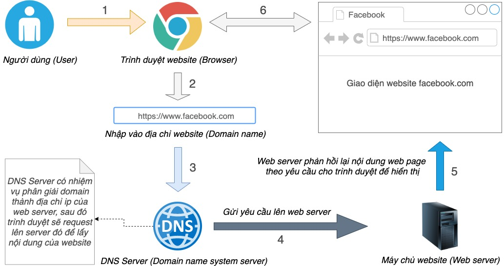
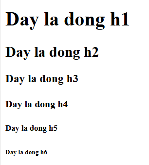
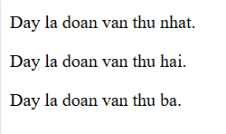
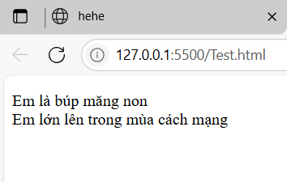
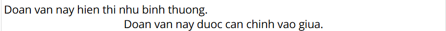
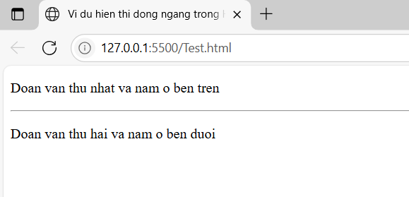
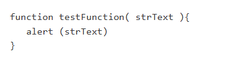
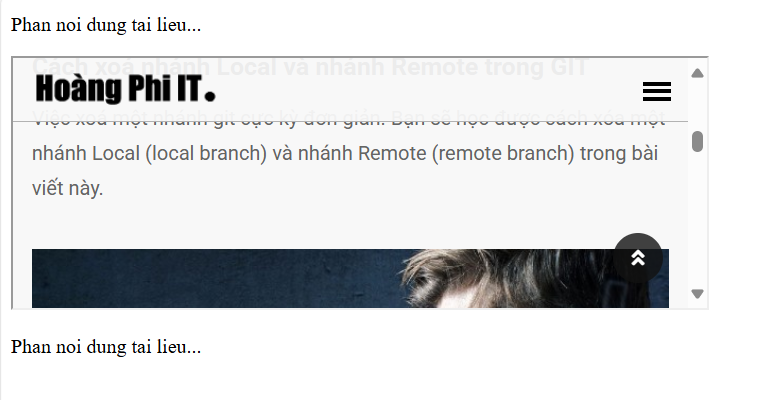
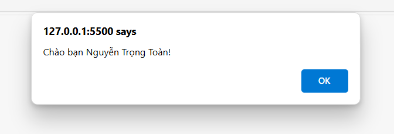

# Buổi 1 - Cơ bản về Web - HTML
## I,Cách thức hoạt động của 1 trang Web

1. Đầu tiên để dễ hình dung, bạn hãy xem qua mô hình hoạt động của một website mà mình vẽ ra ở dưới nhé, trình tự hoạt động mình đã đánh số thứ tự.


2. Một số thuật ngữ Trong Web
   + **Trình duyệt Web**: Nó đơn giản chỉ là 1 phần mềm để người dùng tương tác với website. Ví dụ như: Chrome,...
   + **Tên Miền(Domain)**: là tên định danh của một website nào đó, ví dụ như facebook.com hay google.com
   + **Máy chủ Website(Web Server)**: là nơi lưu trữ mã nguồn(source code) của website và được xác định bằng 1 **địa chỉ IP**. Thực ra server cũng giống như máy tính cá nhân của mình thôi , khi tham gia vào mạng thì phải được định danh bằng địa chỉ IP, mỗi máy có duy nhất 1 địa chỉ IP. Nên biết thêm , với các hệ thống website lớn như facebook hay google người ta sẽ luôn dùng 1 máy chủ riêng , thậm chí là kết hợp nhiều máy chủ để có hiệu suất tốt hơn. còn đối với các website vừa nhỏ vừa không có lượng truy cập cao thì người ta chỉ thuê dùng 1 phần nhỏ tài nguyên của sever thôi, và một phần đó của server người tạ gọi là **Hosting** hoặc có thể là **VPS**.
   + **DNS Server (Domain name system server)**: DNS sever có nhiệm vụ là gắn một tên miền (Domain) và một IP của một server nào đó . Để khi người dùng chỉ cần nhập tên miền thì server này sẽ phân giải IP của một Server được gán để trình duyệt web biết được nội dung của website cần được lấy ở nội dung nào.
3. Mô Hình hoạt động của Website :
   + Đầu tiên người dùng sẻ mở trình duyệt websize lên , ở hình trên thì giả sử sử dụng chrome
   + Người dùng nhập vào thanh địa chỉ một địa chỉ website , ví dụ là https://facebook.com.
   + Trình duyệt sẽ gửi yêu cầu đến DNS Server (Domain name system server). DNS server có nhiệm vụ phân giải domain thành ip của server chứa tài nguyên (Source code) của website ứng tới domain đó. Nói phân giải nghe có vẻ oai, chứ thực ra lúc đăng ký domain bạn phải cấu hình IP của web server vào đó rồi, DNS server chỉ là đã lưu lại, lúc cần thì đưa ra thôi.
   + Sau khi nhận được IP, trình duyệt sẽ tiếp tục gửi yêu cầu truy suất thông tin của website đến web server thông qua IP đã nhận được. 
   + Khi web server nhận được yêu cầu truy xuất nội dung website từ trình duyệt, ngay lập tức server sẽ xử lý thông tin và trả về nội dụng website theo yêu cầu (Server sẽ gửi về một tập hợp các file bao gồm HTML/CSS, các tập tin đa phương tiện, như hình ảnh, video,... nếu có).
   + Sau khi nhận được tài nguyên mà web server phản hồi, trình duyệt sẽ render nó thành giao diện website mà chúng ta nhìn thấy trên màn hình.
## II, Giới thiệu, cấu trúc của HTML 
    1. Khái niệm của HTML
   
       1. HTML có tên đầy đủ là HyperText Markup Language là ngôn ngữ đánh dấu siêu văn bản. HTML thường được sử dụng để tạo và cấu trúc các phần trong trang web và ứng dụng, phân chia các đoạn văn, heading, link, blockquotes,… 
       2. HTML không phải là một ngôn ngữ lập trình mà chỉ là một ngôn ngữ đánh dấu. Điều này đồng nghĩa với việc HTML không thể thực hiện các chức năng “động”. Nói cách khác, HTML tương tự như phần mềm Microsoft Word, chỉ có tác dụng định dạng các thành phần có trong website.
   
    2. HTML và XHTML đều là ngôn ngữ đánh dấu dùng để xây dựng trang web, nhưng chúng có những khác biệt quan trọng về cú pháp, mức độ nghiêm ngặt, và mục đích sử dụng.
   
    dưới đây là bảng so sách rõ ràng:

| Tiêu chí       | HTML (HyperText Markup Language)      | XHTML (eXtensible HTML)      |
|------------|------------|------------|
| Chuẩn | Dựa trên SGML (Standard Generalized Markup Language) | Dựa trên XML (eXtensible Markup Language) |
| Cú Pháp     | Linh hoạt hơn , dễ bỏ qua lỗi cú pháp    | Nghiêm ngặt , phải đúng cú pháp XML     |
| Thẻ | Có thể viết <br>,  không cần đóng |  Phải viết đầy đủ như <br />, |
| Chữ hoa/thường |Không phân biệt (có thể viết <DIV> hoặc <div>)  | Phân biệt chữ hoa và thường (<div> hợp lệ, <DIV> sai) |
| Attribute (thuộc tính) | Có thể bỏ giá trị (checked, disabled) |Phải có giá trị đầy đủ (checked="checked")  |
| Khả năng xử lý lỗi | trình duyệt vẫn hiển thị mặc dù lỗi cú pháp | Nếu sai cú pháp , Trình duyệt có khả năng không hiển thị  |
| Ứng dụng phổ biến  | Rộng rãi trong hầu hết trang web hiện nay | Ít phổ biến hơn, chủ yếu dùng khi cần tích hợp XML |
| MINE TYPE  | 	text/html | application/xhtml+xml |

```php
<!DOCTYPE html> <!--Kiểu tài liệu-->
<html> <!--Đóng gói tất cả nội dung của HTML-->
    <head>
        <!--Hiển thị nội dung tiêu đề-->
        <title>Tiêu đề trang</title>
    </head>
    <body>
        <!--Hiển thị nội dung của trang web sẽ nằm trong cặp thẻ này-->
        <h1>Nguyễn Trọng Toàn</h1>
    </body>
</html>
```
3. Các thuật ngữ phổ biến của HTML
   + **Elements (Phần tử)**: ta có thể hiểu 1 cách đơn giản là một phần của trang web, hay khoa học hơn 1 xíu là thì nó là các chỉ định dùng để xác định cấu trúc và nội dung của một trang web , có thể hiểu theo cách sau đây: 1 trang web thì nó được kết hợp từ nhiều phần tử nhỏ khác nhau và mỗi phần tử nhỏ nhỏ đó được gọi là Element , như vậy một Trang HTML sẽ được bao gồm hàng loạt các Elements
   + **Tag(Thẻ)**: Element được thể hiện bằng Tag nhé . Trong HTML có nhiều loại Tag để thực hiển nhiều mục đích khác nhau. Thẻ thường sẽ được đi theo một cặp gồm một thẻ mở để đánh dấu bắt đầu của một Element , và một thẻ đóng để xác định kết thúc một Element. Nội dung nằm giữa 2 thẻ đóng và thẻ mở này được gọi là nội dung của Element đó. Thẻ mở và thẻ đóng được khai báo gần như giống nhau chỉ khác ở thẻ đóng có thêm dấu **/** ở trước tên thẻ.
   + **Attributes(Thuộc tính)**: là các thành phần cung cấp thông tin bổ sung cho các Element. Các thuộc tính này luôn được chỉ định trong thẻ mở bao gồm tên thuộc tính và giá trị.
  
* Thẻ **```<head>```** : Là một phần từ con của phần tử **html** . Những nội dung trong thẻ này dùng để khải báo thông tin kèm theo của trang, ví dụ mình khai báo tiêu để của tài liệu ở trong này (Tiêu đề tài liệu sẽ được hiển thị trên thanh tiêu đề của cửa sổ trình duyệt hay hiển thị trên kế quả tìm kiếm của google), hoặc để liên kết với tài nguyên khác bên ngoài mà mình muốn dùng nó vào trang web của mình. Nội dung bên trong phần tử này sẽ không được hiển thị lên trên giao diện của website nhé. 
* Thẻ **```Body```** :  Phần tử này dùng để chứa nội dung trang hiển thị. Tức là tất cả nội dung nào nằm trong phần tử này sẽ được hiển thị trên giao diện website.
* Thẻ **```Meta```**: 
  ví dụ: 
```php
<meta charset="utf-8"> 
Phần tử này được tạo từ thẻ "meta" được gán một thuộc tính có tên là charset và giá trị là utf-8. Dùng để thông báo cho trình duyệt rằng, website của tôi đang dùng bảng mã UTF-8. Sau này tất cả các website mình làm đều nên sử dụng bảng mã này, đây là bảng mã chuẩn cho Website. Như bạn thấy , thẻ trên không có thẻ đóng, Theo em được biết thì trong HTML có một số Element không cần đến thẻ đóng.
```
## III Các thẻ HTML cơ bản
### Các thẻ văn bản từ h1-h6
* 
   ví dụ:

```php
<!DOCTYPE html>
<html>
    <head>
        <title>Trang web basic</title>
    </head>
    <body>
        <h1>Day la dong h1</h1>
        <h2>Day la dong h2</h2>
        <h3>Day la dong h3</h3>
        <h4>Day la dong h4</h4>
        <h5>Day la dong h5</h5>
        <h6>Day la dong h6</h6>
        
    </body>
</html>
```

### Thẻ biểu diễn đoạn văn trong HTML
Thẻ `<p>`, với p là viết tắt của **Paragraph**, giúp cấu trúc tài liệu HTML của bạn thành các đoạn văn khác nhau. Mỗi một đoạn văn trong tài liệu HTML sẽ ở trong một thẻ mở `<p>` và một thẻ đóng `</p>` như ví dụ bên dưới.
* Ví dụ:
```php
<!DOCTYPE html>
<html>
<head>
<title>Vi du the p trong HTML</title>
</head>
<body>
<p>Day la doan van thu nhat.</p>
<p>Day la doan van thu hai.</p>
<p>Day la doan van thu ba.</p>
</body>
</html>
```

### Thẻ ngắt dòng trong HTML-Thẻ br trong HTMl
* bất cứ khi nào sử dụng thẻ `<br />` thì các đối tượng theo sau đó nó sẽ bắt đầu từ dòng tiếp theo. Thẻ này là một ví dụ cho một khoảng trống trong tài liệu , tại đó bạn không cần các thẻ mở và đóng vì sẻ không có gì trong đó.
* Thẻ `<br />` có một khoảng trống giữa hai ký từ br và dấu gạch chéo theo sau. Nếu bạn bỏ sót khoảng trống này, các trình duyệt cũ hơn sẽ gặp vấn đề trong việc hiển thị sự ngắt dòng, trong khi nếu bạn quên dấu gách chéo theo sau và chỉ sử dụng <br> thì sẽ không có hiệu lực trong XHTML.
* Ví dụ:
```php
<!DOCTYPE html>
<html>
    <head>
        <title>hehe</title>
    </head>
    <body>
        <p>
            Em là búp măng non <br />
            Em lớn lên trong mùa cách mạng <br />
        </p>
    </body>
</html>
```

### Căn chỉnh nội dung trung tâm - Thẻ center trong HTML
* Bạn có thể sử dụng thẻ`<center>` để căn chỉnh bất kì nội dung nào vào phần trung tâm của trang hoặc của bất ký ô nào trong bảng.
* Ví dụ:
```php
<!DOCTYPE html>
<html>
<head>
<title>Vi du the center trong HTML</title>
</head>
<body>
<p>Doan van nay hien thi nhu binh thuong.</p>
<center>
<p>Doan van nay duoc can chinh vao giua.</p>
</center>
</body>
</html>
```

### hiển thị các dòng ngang trong HTML - thẻ hr trong HTML
* các đường ngang được sử dụng để ngăn cách các khu vực trong tài liệu. Thẻ `<hr>` tạo 1 dòng ngang từ vị trí hiện tại trong tài liệu đến lề phải và do đó tạo ra 1 dòng ngắt.
* Ví dụ:
```php
<!DOCTYPE html>
<html>
<head>
<title>Vi du hien thi dong ngang trong HTML</title>
</head>
<body>
<p>Doan van thu nhat va nam o ben tren</p>
<hr />
<p>Doan van thu hai va nam o ben duoi</p>
</body>
</html>
```

### Giữ nguyên định dạng trong HTML - Thẻ pre trong HTML
* Đôi khi bạn muốn văn bản của bạn được hiển thị như những gì bạn đã viết. Trong những trường hợp này, bạn có thể sử dụng thẻ xác định định dạng trước là <pre>.

* Khi đó, bất kỳ văn bản nào xuất hiện trong thẻ mở <pre> và thẻ đóng </pre> sẽ duy trì cái định dạng trong tài liệu nguồn.
* Ví dụ:
```php
<!DOCTYPE html>
<html>
<head>
<title>Vi du the pre trong HTML</title>
</head>
<body>
<pre>
function testFunction( strText ){
   alert (strText)
}
</pre>
</body>
</html>
```
* Kết quả hiển thị khi bạn chạy đoạn code trên là:


## Thẻ liên kết & media: 

### Thẻ a trong HTML
* Một liên kết được xác định bằng cách sử dụng thẻ `<a>`. Thẻ này gọi là thẻ neo (anchor tag), và bất kỳ ở giữa thẻ mở `<a>` và thẻ đóng `</a>` trở thành một phần của đường liên kết và khi người sử dụng có thể nhấn chuột vào phần đó để tới với tài liệu được gán liên kết. Dưới đây là cú pháp sử dụng thẻ `<a>`.

```php
<a href="đường dẫn url tới trang HTML" ... danh-sách-thuộc-tính>Link Text</a>
```
* Ví dụ:
```php
<!DOCTYPE html>
<html>
    <head>
        <title>
            hehe
        </title>
    </head>
    <body>
        <p>Hay nhan vao day</p>
        <a href="https://vietjack.com/html/text_link_trong_html.jsp"> vietjack</a>
    </body>
</html>
```
* kết quả:
<!DOCTYPE html>
<html>
    <head>
        <title>
            hehe
        </title>
    </head>
    <body>
        <p>Hay nhan vao day</p>
        <a href="https://vietjack.com/html/text_link_trong_html.jsp"> vietjack</a>
    </body>
</html>

### Image Link trong HTML
* Dưới đây là một ví dụ về sử dụng hình ảnh như một siêu liên kết. Chúng ta chỉ cần sử dụng một hình ảnh bên trong một siêu liên kết tại vị trí của văn bản.c
```php
<!DOCTYPE html>
<html>
    <head>
        <title>
            hehe
        </title>
    </head>
    <body>
        <p>Hay nhan vao day</p>
        <a href="https://vietjack.com/html/text_link_trong_html.jsp"> 
            
        </a>
    </body>
</html>
```
<!DOCTYPE html>
<html>
    <head>
        <title>
            hehe
        </title>
    </head>
    <body>
        <p>Hay nhan vao day</p>
        <a href="https://vietjack.com/html/text_link_trong_html.jsp"> 
            
        </a>
    </body>
</html>

### Iframe trong HTML
* Bạn có thể xác định một Iframe với thẻ `<iframe>`. Thẻ `<iframe>` không liên quan đến thẻ `<frameset>`, thay vào đó, nó có thể xuất hiện ở bất cứ đâu trong tài liệu của bạn. Các thẻ `<iframe>` xác định một khu vực trong trang mà tại đó trình duyệt có thể hiển thị một trang riêng biệt, bao gồm cả thanh cuốn và Border. Nói một cách đơn giản là thẻ này dùng để nhúng một trang khác vào trang hiện tại.

* Thuộc tính src được sử dụng để xác định địa chỉ URL của trang mà chứa Iframe.
* Ví dụ:
```php
<!DOCTYPE html>
<html>
<head>
<title>Vi du the Iframe trong HTML</title>
</head>
<body>
<p>Phan noi dung tai lieu...</p>
<iframe src="https://hoangphiit.com/post/bai-5-tiep-can-sau-hon-hieu-ro-hon-ve-html" width="555" height="200">
   Rat tiec vi trinh duyet cua ban khong ho tro Iframe.
</iframe>
<p>Phan noi dung tai lieu...</p>
</body>
</html>
```
*kết quả sẽ được như thế này:

### Danh sách trong HTML
* HTML cung cấp cho người lập trình web3 cách để xác định danh sách các thông tin. Tất cả các danh sách phải chứa một hoặc nhiều phần tử list. Danh sách có thể gồm:
`<ul>` - Một danh sách không có thứ tự. Nó được sắp xếp bằng cách sử dụng các bullet thường.
`<ol>` - Một danh sách đã qua sắp xếp. Nó sử dụng một lược đồ số để liệt kê danh sách.
`<dl>` - Danh sách định nghĩa trong HTML. Sắp xếp danh sách theo cách tương tự như chúng được sắp xếp trong từ điển.

* Ví dụ:
```php
<!DOCTYPE html>
<html>
<head>
<title>Vi du danh sach chua qua sap xep</title>
</head>
<body>
   <ul>
   <li>Beetroot</li>
   <li>Ginger</li>
   <li>Potato</li>
   <li>Radish</li>
   </ul>
</body>
</html>
```
* kết quả là:

<!DOCTYPE html>
<html>
<head>
<title>Vi du danh sach chua qua sap xep</title>
</head>
<body>
   <ul>
   <li>Beetroot</li>
   <li>Ginger</li>
   <li>Potato</li>
   <li>Radish</li>
   </ul>
</body>
</html>

* Thuộc tính type trong HTML
Bạn có thể sử dụng thuộc tính type cho thẻ <ul> để xác định kiểu của bullet mà bạn thích. Theo mặc định nó có hình dạng chiếc đĩa tròn (disc). Có các tùy chọn kiểu cho bạn sử dụng:

```php
<ul type="square">
<ul type="disc">
<ul type="circle">
```
### Danh sách đã qua sắp xếp trong HTML
Nếu bạn được yêu cầu đặt các mục trong danh sách theo thứ tự số thay vì sử dụng các bullet thì loại danh sách đã qua sắp xếp sẽ được sử dụng. Danh sách này được tạo bởi thẻ `<ol>`. Thứ tự số bắt đầu từ 1 và lượng gia thêm một cho các mục tiếp theo với thẻ `<li>`.

Ví dụ:
```php
<!DOCTYPE html>
<html>
<head>
<title>Vi du danh sach da qua sap xep</title>
</head>
<body>
<ol>
<li>Beetroot</li>
<li>Ginger</li>
<li>Potato</li>
<li>Radish</li>
</ol>
</body>
</html>
```

kết quả là: 
<!DOCTYPE html>
<html>
<head>
<title>Vi du danh sach da qua sap xep</title>
</head>
<body>
<ol>
<li>Beetroot</li>
<li>Ginger</li>
<li>Potato</li>
<li>Radish</li>
</ol>
</body>
</html>

* Thuộc tính type trong HTML

* Bạn có thể sử dụng thuộc tính type cho thẻ `<ol>` để xác định kiểu của loại thứ tự số mà bạn thích. Theo mặc định, nó là một số. Dưới đây là các tùy chọn có thể:

```
<ol type="1"> - Gia tri so mac dinh.
<ol type="I"> - Gia tri so La Ma dang chu hoa.
<ol type="i"> - Gia tri so La Ma dang chu thuong.
<ol type="a"> - Chu cai thuong.
<ol type="A"> - Chu cai hoa.
```
* Thuộc tính start trong HTML

* Bạn có thể sử dụng thuộc tính start cho thẻ `<ol>` để xác định điểm bắt đầu của dãy số bạn muốn. Dưới đây là các tùy chọn có thể:

```
<ol type="1" start="4">    - Day so bat dau tu 4.
<ol type="I" start="4">    - Day so bat dau tu IV.
<ol type="i" start="4">    - Day so bat dau tu iv.
<ol type="a" start="4">    - Day chu cai bat dau tu d.
<ol type="A" start="4">    - Day chu cai bat dau tu D.
```

Ví dụ này chúng tôi sử dụng `<ol type="i" start="4" >`
```php
<!DOCTYPE html>
<html>
<head>
<title>Vi du danh sach da qua sap xep</title>
</head>
<body>
   <ol type="i" start="4">
   <li>Beetroot</li>
   <li>Ginger</li>
   <li>Potato</li>
   <li>Radish</li>
   </ol>
</body>
</html>
```
* Kết quả là:
<!DOCTYPE html>
<html>
<head>
<title>Vi du danh sach da qua sap xep</title>
</head>
<body>
   <ol type="i" start="4">
   <li>Beetroot</li>
   <li>Ginger</li>
   <li>Potato</li>
   <li>Radish</li>
   </ol>
</body>
</html>

### Danh sách định nghĩa trong HTML - Thẻ dl trong HTML

* HTML và XHTML hỗ trợ một kiểu danh sách mà được gọi là Definition list - Danh sách định nghĩa, là nơi mà các mục được liệt kê dưới dạng giống một từ điển hoặc một quyển bách khoa toàn thư. Danh sách này là một cách tuyệt vời để hiển thị một bảng danh sách, bảng chú giải của các mục dữ liệu.
* Danh sách định nghĩa sử dụng 3 thẻ theo sau:

```
<dl> - Xác định phần bắt đầu của danh sách
<dt> - Một mục
<dd> - Định nghĩa của mục
</dl> - Xác định phần kết thúc của danh sách
```

* Ví dụ:

```php
<!DOCTYPE html>
<html>
<head>
<title>Vi du the dl trong HTML</title>
</head>
<body>
<dl>
<dt><b>HTML</b></dt>
<dd>La viet tat cua Hyper Text Markup Language</dd>
<dt><b>HTTP</b></dt>
<dd>La viet tat cua Hyper Text Transfer Protocol</dd>
</dl>
</body>
</html>
```
* kết quả là: 
<!DOCTYPE html>
<html>
<head>
<title>Vi du the dl trong HTML</title>
</head>
<body>
<dl>
<dt><b>HTML</b></dt>
<dd>La viet tat cua Hyper Text Markup Language</dd>
<dt><b>HTTP</b></dt>
<dd>La viet tat cua Hyper Text Transfer Protocol</dd>
</dl>
</body>
</html>

### Bảng trong HTML

* Các bảng HTML cho phép lập trình viên sắp xếp các dữ liệu như văn bản, hình ảnh, đường link… vào các ô trong bảng.

* Bảng HTML được tạo ra bằng cách sử dụng thẻ `<table>` trong đó: thẻ `<tr>` được sử dụng để tạo các hàng và thẻ `<td>` được sử dụng để tạo các ô.

* Ví dụ: 
```php 
<!DOCTYPE html>
<html>
<head>
<title>Vi du bang trong HTML</title>
</head>
<body>
<table border="1">
<tr>
<td>Row 1, Column 1</td>
<td>Row 1, Column 2</td>
</tr>
<tr>
<td>Row 2, Column 1</td>
<td>Row 2, Column 2</td>
</tr>
</table>
</body>
</html>
```
* kết quả là:  
<!DOCTYPE html>
<html>
<head>
<title>Vi du bang trong HTML</title>
</head>
<body>
<table border="1">
<tr>
<td>Row 1, Column 1</td>
<td>Row 1, Column 2</td>
</tr>
<tr>
<td>Row 2, Column 1</td>
<td>Row 2, Column 2</td>
</tr>
</table>
</body>
</html>

* Tại đây border là một thuộc tính của thẻ `<table>` và được sử dụng để đặt Border (đường viền) dọc tất cả các ô. Nếu bạn không cần Border, bạn có thể sử dụng border="0".
### Tiêu đề Bảng trong HTML
Tiêu đề bảng có thể được xác định bằng thẻ `<th>`. Thẻ này để thế chỗ cho thẻ `<td>` , mà được sử dụng để đại diện cho các ô dữ liệu. Thông thường bạn sẽ đặt hàng đầu tiên của bảng là tiêu đề như hình dưới, ngoài ra bạn có thể sử dụng phần tử `<th>` trong bất kỳ hàng nào.
* Ví Dụ:
```php
<!DOCTYPE html>
<html>
<head>
<title>Vi du tieu de bang</title>
</head>
<body>
<table border="1">
<tr>
<th>Ten nhan vien</th>
<th>Luong</th>
</tr>
<tr>
<td>Minh Chinh</td>
<td>5000</td>
</tr>
<tr>
<td>Duy Manh</td>
<td>7000</td>
</tr>
</table>
</body>
</html>
```
kết quả là;
<!DOCTYPE html>
<html>
<head>
<title>Vi du tieu de bang</title>
</head>
<body>
<table border="1">
<tr>
<th>Ten nhan vien</th>
<th>Luong</th>
</tr>
<tr>
<td>Minh Chinh</td>
<td>5000</td>
</tr>
<tr>
<td>Duy Manh</td>
<td>7000</td>
</tr>
</table>
</body>
</html>

Bạn có thể tham khảo thêm :

[Tham Khảo Thêm](https://vietjack.com/html/bang_trong_html.jsp)

### Form trong HTML
+ Các thuộc tính của thẻ form trong HTML
+ Ngoài các thuộc tính thông thường, sau đây là các thuộc tính của form hay sử dụng:

| Thuộc Tính      | Miêu Tả     |
|------------|------------|
| Action | Ứng dụng quản trị back-end sẵn sàng để xử lý dữ liệu từ site khách. | 
| method     | Phương thức để tải dữ liệu lên. Thường sử dụng là GET và POST.   | 
| target | Xác định cửa sổ hoặc frame để hiển thị kết quả. Thuộc tính có thể nhận các giá trị như _blank, _self, _parent….| 
| enctype | Bạn sử dụng thuộc tính này để xác định cách mà trình duyệt mã hóa dữ liệu trước khi nó gửi tới Server. Các giá trị có thể nhận là:**application/x-www-form-urlencoded** - Đây là phương thức tiêu chuẩn mà hầu hết các form sử dụng. **mutlipart/form-data**    - Nó được sử dụng khi bạn muốn tải lên dữ liệu nhị phân trong mẫu form của các file như ảnh, word….| 
### Một số form hữu ích trong HTML
Có các kiểu kiểm soát form khác nhau mà bạn có thể sử dụng để thu thập dữ liệu:

+   Text Input

+   Checkbox

+  Radio Box

+   Select Box

+   File Select Box

+   Submit
### Text Input trong HTML
* Có 3 kiểu Text Input được sử dụng trên form:

* Text Input một dòng đơn - Sử dụng cho các mục mà yêu cầu chỉ một dòng của dữ liệu đầu vào của người sử dụng như các hộp tìm kiếm hoặc tên. Form này được tạo ra bằng cách sử dụng thẻ `<input>`.

**Password Input** - Đây cũng là một Text Input một dòng đơn nhưng nó giấu các ký tự ngay sau khi người sử dụng nhập nó. Form này được tạo ra bằng cách sử dụng thẻ `<input>`.

**Text Input** đa dòng - : Được sử dụng khi một người sử dụng được yêu cầu cung cấp thông tin mà có thể nhiều hơn một dòng. Form này được tạo ra bằng cách sử dụng thẻ `<textarea>`.

Tham Khảo thêm:
[Tham Khảo](https://vietjack.com/html/form_trong_html.jsp)

## Thẻ script, HTML JS?

* Thẻ `<script>` trong HTML được dùng để gắn mã JavaScript vào trang web. Đây là cách để giúp HTML tương tác, xử lý logic, tạo hiệu ứng động v.v
* Ví dụ:
1. Gắn mã JavaScript trực tiếp trong file HTML:
```php
<!DOCTYPE html>
<html>
<head>
  <title>Trang web JS</title>
</head>
<body>
  <h1>Xin chào!</h1>

  <script>
    alert("Chào bạn Nguyễn Trọng Toàn!");
    console.log("Thông báo này chỉ hiển thị trong Console trình duyệt.");
  </script>
</body>
</html>
```
kết quả là:


* HTML JS thường là cách viết tắt khi người ta nói đến việc sử dụng JavaScript trong HTML – nghĩa là kết hợp JavaScript (JS) để điều khiển, tương tác, hoặc xử lý logic trên trang HTML.


# Kiến Thức HTML Cơ Bản: Thuộc Tính, Thẻ div/span, Element & Semantic HTML

---

## 1. Các Thuộc Tính Phổ Biến Trong HTML

| Thuộc tính     | Mô tả |
|----------------|------|
| `class`        | Gán tên lớp cho phần tử để CSS hoặc JS sử dụng. Có thể có nhiều class. |
| `id`           | Gán định danh duy nhất cho phần tử. Không được trùng. |
| `required`     | Bắt buộc nhập (dùng trong thẻ `<input>`). |
| `type`         | Xác định loại input (text, password, submit, email,...) |
| `value`        | Giá trị mặc định của input hoặc button. |
| `placeholder`  | Gợi ý văn bản hiển thị trong ô nhập. |
| `name`         | Tên thuộc tính, dùng khi gửi dữ liệu form. |

**Ví dụ:**
```html
<input type="email" id="email" class="form-input" placeholder="Nhập email" required>
```

---

## 2. Thẻ `<div>` và `<span>`

| Thẻ       | Loại | Mô tả | Dùng để |
|-----------|------|--------|---------|
| `<div>`   | Block | Thẻ bao khối – chiếm toàn bộ chiều ngang | Gói nhóm nội dung lớn |
| `<span>`  | Inline | Thẻ bao dòng – chỉ chiếm nội dung bên trong | Gói nhóm văn bản nhỏ |

**Ví dụ:**
```html
<div class="box">
  <p>Đây là <span class="highlight">HTML cơ bản</span>.</p>
</div>
```

---

## 3. Phân Loại Element: Block vs Inline

###  Block Elements:
- Chiếm toàn bộ chiều ngang
- Tự xuống dòng
- Có thể chứa thẻ block và inline

**Ví dụ:** `<div>`, `<p>`, `<h1>` đến `<h6>`, `<section>`, `<article>`, `<ul>`, `<table>`,...

###  Inline Elements:
- Không xuống dòng
- Chỉ chiếm đúng phần nội dung
- Không chứa block element

**Ví dụ:** `<span>`, `<a>`, `<strong>`, `<em>`, ``, `<input>`,...

**Ví dụ minh họa:**
```html
<p>Đây là một <span>văn bản inline</span> trong thẻ p (block).</p>
```

---

## 4. Semantic HTML

| Thẻ           | Mô tả |
|---------------|-------|
| `<header>`    | Phần đầu của trang hoặc mục |
| `<footer>`    | Phần chân trang hoặc mục |
| `<nav>`       | Khu vực chứa liên kết điều hướng |
| `<section>`   | Một khu nội dung riêng biệt |
| `<article>`   | Nội dung độc lập (bài viết, blog, tin tức) |
| `<aside>`     | Nội dung phụ (quảng cáo, sidebar) |
| `<main>`      | Phần nội dung chính |
| `<figure>`    | Dùng cho hình ảnh kèm mô tả |
| `<figcaption>`| Chú thích của hình ảnh |

**Ví dụ:**
```html
<article>
  <header>
    <h2>Bài viết: Học HTML cơ bản</h2>
  </header>
  <p>Nội dung chi tiết ở đây...</p>
  <footer>Đăng bởi Toàn</footer>
</article>
```

---

##  Tổng Kết

| Chủ đề            | Ý chính |
|-------------------|---------|
| Thuộc tính        | `class`, `id`, `type`, `required`,... giúp kiểm soát hành vi & định dạng |
| `div` vs `span`   | `div` là block, `span` là inline – dùng đúng loại để bố cục chuẩn |
| Block vs Inline   | Quan trọng khi dàn trang & viết CSS |
| Semantic HTML     | Viết code rõ nghĩa, thân thiện SEO và trình đọc màn hình |
