# Buổi 2 - CSS
## I, Selectors
- **Selector (Bộ chọn):** Như buổi trước, HTMT chúng ta tìm hiểu được là được HTML bao gồm các phần tử(elements). Mỗi phần tử như vật chúng ta hoàn toàn có thể dùng CSS để tạo kiểu cho nó , vậy với hàng loạt phần tử như thế, làm sao CSS biết được nó dùng để tạo kiểu cho phần tử hay một cụm phần tử nào.Thì bộ chọn này giúp chúng ta làm được điều đó , bộ chọn dùng để xác định chính xác những phần tử nào trong HTML bạn muốn tạo kiểu.
- **Properties (Thuộc tính) và Value(Giá trị):** Sau khi chúng ta dùng Selectors để chọn ra một phần tử , chúng ta cần khai báo các thuộc tính và gán cho thuộc tính đó một giá trị, mục đích là để xác định kiểu mà chúng ta muốn áp dụng cho phần tử được chọn.
- Ví dụ:

```css
p{
    color: orange;
    font-size: 16px;
}
```

- Cấu trúc trên sẽ giúp CSS chọn hết tất cả các phần tử được tạo từ thẻ `<p>`. Việc chúng ta khai báo p{} gọi là Selectors.
## Chương trình đầu tiên của CSS

```css
h1{
    background-color: dodgerblue;
    text-align: center;
    color: white;
    font-size: 24px;
    padding: 10px;
}
p{
    color:brown;
    font-size: 20px;
}
```

```html
<!DOCTYPE html>
<html lang="en">
<head>
  <meta charset="UTF-8">
  <meta name="viewport" content="width=device-width, initial-scale=1.0">
  <title>Document</title>
  <link rel="stylesheet" href="Test.css">
</head>
<body>
  <h1>Chào mừng bạn đến với Web của NTT</h1>
  <p>Chào mừng bạn đến với web của NTT , sau đây là facebook của mình <a href="https://www.facebook.com/nguyentrongtoan2710">Nguyễn Trọng Toàn</a></p>
</body>
</html>
```
- Kết quả:
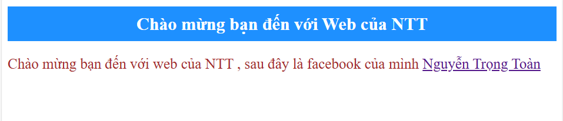

- Đây là code đầu tiên khi mình bắt đầu học css

## II, 3 Kiểu chèn CSS
**1.External CSS(CSS ngoài)**
  - Đây là cách **tốt nhất** và **được khuyến khích sử dụng** nhiều nhất trong các dự án thực tế, Bạn sẽ viết toàn bộ code CSS vào một file có đuôi .css riêng biệt , sau đó dùng thẻ '<link>' để nhúng file vào HTML.
  - Cách làm: đặt thẻ '<link>' trong phần '<head>' của file HTML.
  Ví dụ : ở trên.
- Ưu điểm: 
  - **Dễ Bảo trì:** Tách hoàn toàn HTML và CSS
  - **Tái sử dụng:** Một file CSS có thể dùng được cho nhiều trang HTML khác nhau
  - **Tăng tốc độ tải trang:** Trình duyệt có thể lưu file CSS vào bộ nhớ đệm (cache), giúp các lần tải trang sau nhanh hơn

**2.Internal CSS(CSS nội bộ)**
- Với cách này, bạn viết code CSS trực tiếp trong thẻ `<style>` ở phần `<head>` của file HTMl.
- Cách làm: Toàn bộ code CSS nằm gọn trong thẻ `<style>`.
```html
<!DOCTYPE html>
<html lang="en">
<head>
  <meta charset="UTF-8">
  <meta name="viewport" content="width=device-width, initial-scale=1.0">
  <title>Document</title>
  <!-- <link rel="stylesheet" href="Test.css"> -->
   <style>
    body{
      background-color: blue;
    }
    p{
      color: green;
    }
   </style>
</head>
<body>
  <h1>Chào mừng bạn đến với Web của NTT</h1>
  <p>Chào mừng bạn đến với web của NTT , sau đây là facebook của mình <a href="https://www.facebook.com/nguyentrongtoan2710">Nguyễn Trọng Toàn</a></p>
</body>
</html>

```
- Kết quả:
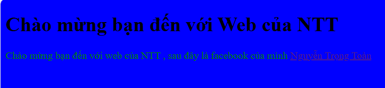

- **Ưu Điểm:**
  - Hữu ích khi bạn chỉ có một trang HTML duy nhất cần định kiểu
  - Tất cả code nằm trang một file, không cần yêu cầu HTTP bổ sung để tải file CSS.
- **Nhược Điểm:**
  - Chỉ ảnh hưởng đến trang HTML chứa nó, không thể tái sử dụng.
  - khiên file HTMl dài và khó quản lí hơn nếu có CSS.

**3.Inline CSS(CSS nội tuyến)**
- Đây là cách chèn CSS trực tiếp vào một thẻ HTML cụ thể thông qua thuộc tính style.
- Cách làm: thêm thuộc tính style = "..." vào thẻ mà bạn muốn định dạng.
```html
<!DOCTYPE html>
<html lang="en">
<head>
  <meta charset="UTF-8">
  <meta name="viewport" content="width=device-width, initial-scale=1.0">
  <title>Document</title>
  
</head>
<body>
  <h1 style="color: aqua; text-align: center;">Chào mừng bạn đến với Web của NTT</h1>
  <p style="font-size: 20px;">Chào mừng bạn đến với web của NTT , sau đây là facebook của mình <a href="https://www.facebook.com/nguyentrongtoan2710">Nguyễn Trọng Toàn</a></p>
</body>
</html>
```
- Kết quả:
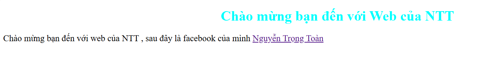
- **Ưu điểm:**
  - Hữu ích khi kiểm tra nhanh một kiểu dáng nào đó.
  - Có độ ưu tiên cao nhất , sẽ ghi đè lên các định dạng từ internal và external CSS.
- **Nhược điểm:**
  - **Rất khó bảo trì:** Trộn lẫn cấu trúc và giao diện, làm code rất rối.
  - Không thể tái sử dụng
  - Được xem là thực hành không tốt và nến tránh sử dụng trong hầu hết các trường hợp.
## III, Colors, Backgrounds, Height, Width
### Colors:
- **Các thuộc tính chính**:
  - colors (Màu chữ)
  - background-color ( Màu nền)
  - border-color (Màu viền)
- **Cách khai báo màu:**
  - Tên Màu: red,blue,green.
  - Mã Hex: #ff0000, #00ff00.
  - RGB:rgb(255, 0, 0)
  - RGBA: rgba(255, 0, 0, 0.5) (thêm độ trong suốt)
  - HSL: hsl(0, 100%, 50%)  (hsl(hue, saturation, lightness))
    - hue là tông màu
    - saturation (độ bão hòa)
    - Lightness(độ sáng )
### Backgrounds
- **Các thuộc tính**
  - background-color : Màu nền
  - background-image : Ảnh nền(dùng url(" đường dẫn "))
  - background-repeat: Lặp lại nền(repeat , no repeat, repeat-x,repeat-y)
  - background-position : Vị trí nền
  - backgournd-size : kích thước ảnh nền
  - background-attachment :Cố định nền
### Height && Width (Chiều cao và chiều rộng)

- **Các thuộc tính**
  - width	Đặt chiều rộng phần tử
  - height:	Đặt chiều cao phần tử
  - min-width:	Chiều rộng tối thiểu
  - max-width:	Chiều rộng tối đa
  - min-height:	Chiều cao tối thiểu
  - max-height:	Chiều cao tối đa
  
- **Các đơn vị thường dùng**
  - px: pixel (ví dụ: width: 200px;)

  - %: phần trăm theo phần tử cha

  - vh / vw: theo chiều cao / rộng của khung nhìn (viewport height/width)

  - em / rem: theo kích thước chữ
## IV, Box Model, Borders, Padding, Margins
1,**Box Model**
Mỗi phần tử **được coi như một "hộp"(box) trong CSS**, hộp đó gồm 4 phần:

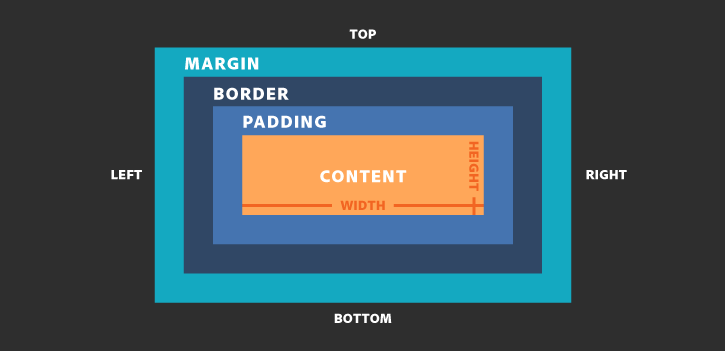

2,**Content**- Nội dung bên trong box
- Đây là phần chứa text, hình ảnh,...
- Chiều rộng và chiều cao được đặt qua width,height.

3, **Padding**- Khoảng cách từ bội dung đến viền
- Tạo khoảng trống bên trong phần tử.
- Giúp nội dung không dính sát vào viền.

Ví dụ:
```css
padding: 10px;
padding-top: 10px;
padding: 10px 20px; /* trên dưới: 10px, trái phải: 20px */
```
4,**Border**- Viền bao quanh padding + content
- Viền có thể có độ dày, kiểu, màu.
```css
border: 2px solid red;
border-top: 1px dashed blue;
```
5,**Margin**-Khoảng cách bên ngoài phần tử
- Tạo khoảng cách giữa phần tử này với phần tử khác.
```css
margin: 20px;
margin: 10px 20px; /* trên dưới 10px, trái phải 20px */

```

Ví dụ minh họa:
```html
<!DOCTYPE html>
<html lang="en">
<head>
  <meta charset="UTF-8">
  <meta name="viewport" content="width=device-width, initial-scale=1.0">
  <title>Document</title>
  <style>
    .box{
      width: 200px;
      height: 100px;
      padding: 20px;
      border: 3px solid blue;
      margin: 30px;
      background-color: lightblue;
    }
  </style>
</head>
<body>
  <div class="box">Content bên trong bos</div>
</body>
</html>
```

Kết quả là:

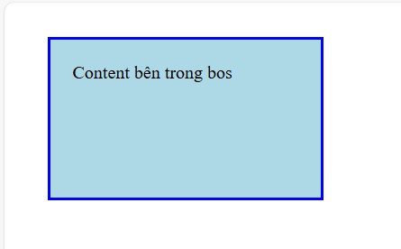

# V,Text, Fonts, Icons, List, Table

**1,Text**

Các thuộc tính phổ biến:
```css
p {
  color: #333;                   /* Màu chữ */
  text-align: center;            /* Căn giữa, trái, phải */
  text-transform: uppercase;     /* lowercase, capitalize */
  text-decoration: underline;    /* overline, line-through, none */
  line-height: 1.6;              /* Khoảng cách dòng */
  letter-spacing: 2px;           /* Khoảng cách giữa các chữ */
  word-spacing: 4px;             /* Khoảng cách giữa các từ */
}
```
```html
<!DOCTYPE html>
<html lang="en">
<head>
  <meta charset="UTF-8">
  <meta name="viewport" content="width=device-width, initial-scale=1.0">
  <title>Document</title>
  <link rel="stylesheet" href="Test.css">
</head>
<body>
  <p>Trang Web cua NTT</p>
</body>
</html>
```
kết quả:
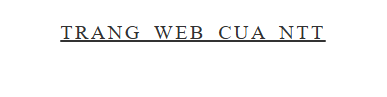

**2,Fonts**
Các thuộc tính về font:
```css
body {
  font-family: 'Arial', sans-serif; /* Phông chữ chính và dự phòng */
  font-size: 16px;                  /* Kích thước chữ */
  font-weight: 400;                 /* Độ đậm: normal, bold, 100–900 */
  font-style: italic;              /* Nghiêng: normal, italic, oblique */
  font-variant: small-caps;        /* Viết hoa dạng nhỏ */
}
font hay dùng...
```
**3,Icons trong CSS**

- Cách thêm biểu tượng
- Cách đơn giản nhất để thêm biểu tượng vào trang HTML của bạn là sử dụng   thư viện biểu tượng, chẳng hạn như Font Awesome.

- Thêm tên của lớp biểu tượng được chỉ định vào bất kỳ phần tử HTML nội tuyến nào (như `<i>`hoặc `<span>`).
- Tất cả các biểu tượng trong thư viện biểu tượng bên dưới đều là các vector có thể mở rộng và tùy chỉnh bằng CSS (kích thước, màu sắc, bóng đổ, v.v.)

Ví dụ:
```html
<!DOCTYPE html>
<html>
  <head>
    <!-- Link Font Awesome (CDN) -->
    <link
      rel="stylesheet"
      href="https://cdnjs.cloudflare.com/ajax/libs/font-awesome/6.4.0/css/all.min.css"
    />
  </head>
  <body>
    <i class="fa-solid fa-user"></i>
    <i class="fa-brands fa-facebook"></i>
  </body>
</html>
  
```
Kết quả:

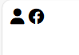

**4, List**

Thuộc tính trong CSS cho phép bạn:
- Đặt các dấu hiệu mục danh sách khác nhau cho danh sách có thứ tự
- Đặt các dấu hiệu mục danh sách khác nhau cho danh sách không có thứ tự
- Đặt hình ảnh làm điểm đánh dấu mục danh sách
- Thêm màu nền vào danh sách và các mục danh sách

Ví dụ:
```html
<!DOCTYPE html>
<html>
<head>
<style>
ul.a {
  list-style-type: circle;
}

ul.b {
  list-style-type: square;
}

ol.c {
  list-style-type: upper-roman;
}

ol.d {
  list-style-type: lower-alpha;
}
</style>
</head>
<body>

<h2>The list-style-type Property</h2>

<p>Example of unordered lists:</p>
<ul class="a">
  <li>Coffee</li>
  <li>Tea</li>
  <li>Coca Cola</li>
</ul>

<ul class="b">
  <li>Coffee</li>
  <li>Tea</li>
  <li>Coca Cola</li>
</ul>

<p>Example of ordered lists:</p>
<ol class="c">
  <li>Coffee</li>
  <li>Tea</li>
  <li>Coca Cola</li>
</ol>

<ol class="d">
  <li>Coffee</li>
  <li>Tea</li>
  <li>Coca Cola</li>
</ol>

</body>
</html>
```

Kết quả:

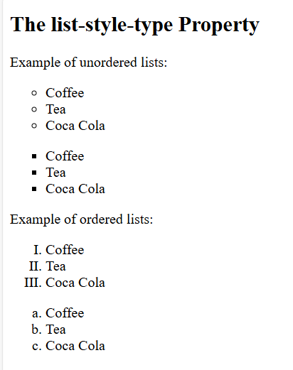

**Bảng Trong CSS**
- **Đường viền bảng**
  - Để chỉ định đường viền bảng trong CSS , hãy sử dụng thuộc tính border
  - Ví dụ:
```html
<!DOCTYPE html>
<html lang="en">
<head>
  <meta charset="UTF-8">
  <meta name="viewport" content="width=device-width, initial-scale=1.0">
  <title>Document</title>
  <style>
    table,th,td{
      border: 1px solid red;
    }
  </style>
</head>
<body>
  <table>
    <tr>
      <th>Tên</th>
       <th>Họ</th>
    </tr>
    <tr>
      <td>Toan</td>
      <td>hehe</td>
    </tr>
    <tr>
      <td>huhu</td>
      <td>hihi</td>
    </tr>
  </table>
</body>
</html>
```
Kết Quả:

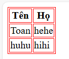

- **Kích thước bảng**
```html
<style>
    table,th,td{
      border: 1px solid red;
    }
    table{
      border-collapse: collapse;
      width: 100%;
    }
    th{
      height: 70px;
    }
  </style>
```
Kết quả:
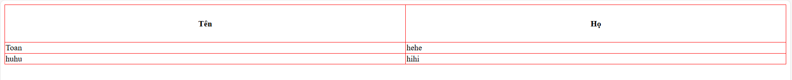
-**căn chỉnh bảng**
```htlm
th {
  text-align: left;
  text-align: center;
  ....
}
```
- **Kiểu Bảng CSS**
  - Table Padding
  - Horizontal Dividers (Vách ngăn ngang)
  - 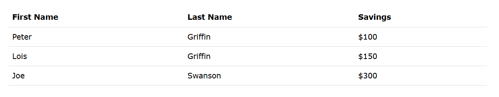
  - Hoverable Table (bảng trỏ chuột)

  ```css
  tr:hover{background-color:aqua;}
  ```
  Kết quả:
  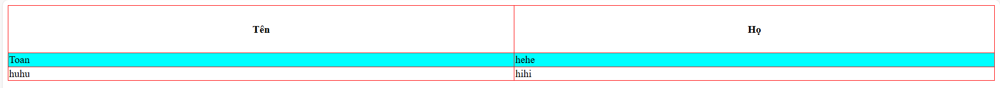
  - Striped Tables( Bảng sọc)
  ```css
  tr:nth-child(even) {background-color: #f2f2f2;}
  ```
  Kết quả:
  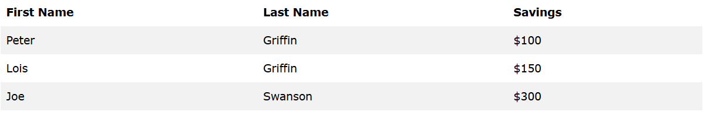
  - Table color (Màu bảng)
  ```css
  th{
      background-color: aqua;
      color: white;
    }
  ```
  kết quả:
  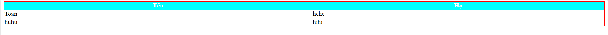


   - CSS Responsive Table( Bảng Phản hồi)
   
   - Thêm một phần tử chứa (như `<div>`) overflow-x:autoxung quanh phần tử `<table>` để làm cho nó có khả năng phản hồi:
  
  kết quả:

  
# VI,Display (inline, block, inline-block, none) 
- Thuộc tính này displayđược sử dụng để chỉ định cách hiển thị một phần tử trên trang web.

- Mỗi phần tử HTML đều có giá trị hiển thị mặc định, tùy thuộc vào loại phần tử. Giá trị hiển thị mặc định cho hầu hết các phần tử là blockhoặc inline.

- Thuộc tính này displayđược sử dụng để thay đổi hành vi hiển thị mặc định của các phần tử HTML.
- The display Property Values
- The Display property has many values:

|Giá trị|Ý nghĩa|
|-------|-------|
|block|Hiển thị như một khối (Chiếm toàn bộ Chiều ngang). Ví dụ `<div`,`<p>`|
|inline|Hiển thị nội tuyến, không xuống dòng, chỉ chiếm chiều rộng nội dung. Ví dụ: `<span></span>`,`<a></a>`|
|inline-block|Kết hợp cả inline và block: không xuống dòng nhưng có thể đặt kích thước|
|none|Ẩn hoàn toàn phần tử(không chiếm chỗ trong layout)|
Ví dụ minh họa:
```css
.box1{
    display: block; background: lightblue;
}
.box2{
    display: inline;background: yellow;
}
.box3{
    display: inline-block; background: pink;width: 100px;height: 50px;
}
.box4{
     display: none;/*Không hiển thị */
}
```
```html
<!DOCTYPE html>
<html lang="en">
<head>
  <meta charset="UTF-8">
  <meta name="viewport" content="width=device-width, initial-scale=1.0">
  <title>Document</title>
  <link rel="stylesheet" href="Test.css">
</head>
<body>
  <div class="box1">Box1</div>
  <div class="box2">Bot2</div>
  <div class="box3">Box3</div>
  <div class="box4">Bot4</div>
</body>
</html>
```
Kết quả:

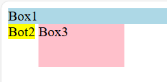

**Phân biệt display: none và visibility: hiden**
|Thuộc tính|Có hiển thị không|Có chiếm không gian không|Có tương tác được không|
|-|-|-|-|
|display: none|Không hiển thị|Không chiếm không gian|Không tương tác được|
|visibility: hiden|Không hiển thị|Vẫn Chiếm không gian|Không tương tác|

# VII,Position (static, fixed, realative, absolute, sticky)

```css
.element {
  position: value; /* static | relative | absolute | fixed | sticky */
  top: 10px;
  left: 20px;
}
```

1, **Position: static**.
- Mặc định không chịu ảnh hưởng bởi top, left,..
- Phần tử hiện theo luồng bình thường
```html
<!DOCTYPE html>
<html lang="en">
<head>
  <meta charset="UTF-8">
  <meta name="viewport" content="width=device-width, initial-scale=1.0">
  <title>Document</title>
  <style>
    div.static{
      position: static;
      border: 3px solid yellow;
    }
  </style>
  <link rel="stylesheet" href="Test.css">
</head>
<body>
  <div class="static">
    This div element has position static;
  </div>
</body>
</html>
```

- div mặc định luôn là static.

kết quả:
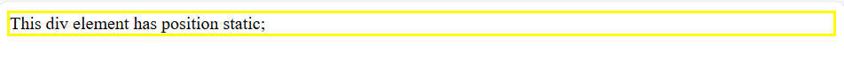

2, **relative (tương đối)**

- Dịch chuyển so với chính vị trí ban đầu của nó
- Không làm ảnh hưởng đến phần tử xung quanh
```css
<style>
    div.relative{
      position: relative;
      left: 50px;
      border: 3px solid yellow;
    }
  </style>
```

Kết quả:
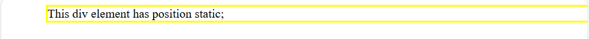
3, **absolute (tuyệt đối)**
- Dịch chuyển tuyệt đối so với phần tử cha gần nhất có postion != static
- Nếu không có cha nào như vậy → tính theo `<html>` (body)
Ví dụ:
```css,html
<style>
    div.relative{
      position: relative;
      left: 50px;
      border: 3px solid yellow;
    }
    div.absolute{
      position: absolute;
      top: 100px;
      right: 50;
      width: 200px;
      height: 100px;
      border: 3px solid red;
    }
  </style>
```

Kết quả:
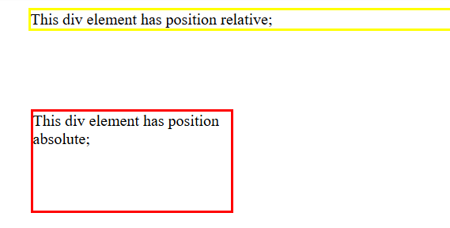
4, **fixed (cố định)**
- Dính chặt vào vị trí trên màn hình (viewport)
- Không cuộn theo trang
- thường dùng cho menu đầu trang, nut back-to-top,...
```css
<style>
      div.fixed {
        position: fixed;
        bottom: 0;
        right: 0;
        width: 300px;
        border: 3px solid #73ad21;
      }
    </style>
```
kết quả:
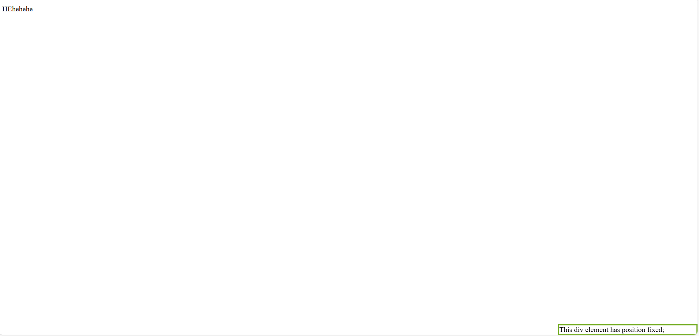
5, **sticky (dính khi cuộn)**
- Ban đầu là relative

- Khi cuộn đến top: 0 thì giữ nguyên vị trí như fixed

- Rất hữu ích cho header cuộn dính
  
```css
<style>
      div.sticky {
        position: sticky;
        top: 0;
        padding: 10px;
        background-color: yellowgreen;
        border: 2px solid palevioletred;
      }
</style>
```
Kết quả:

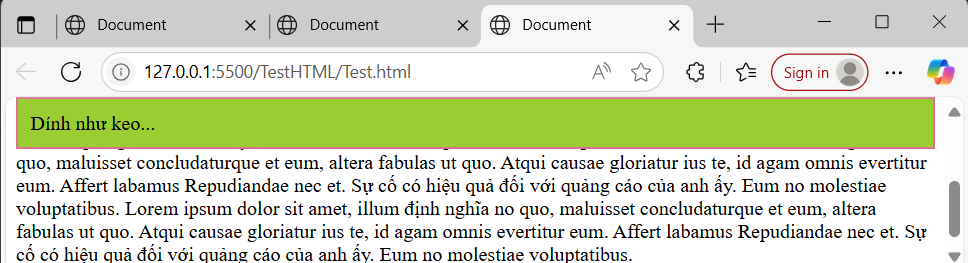

# VIII,Combinator Selectors

- Có 4 loại Combinator Selectors trong CSS
- 
|Combinator|Kí hiệu|ý nghĩa|
|-|-|-|
|Descendant|(space)|Chọn phần tử nằm bên trong phần tử khác(hậu duệ)|
|Child|>|Chọn phần tử là con trực tiếp|
|Adjacent sibling|+|Chọn phần tử kề ngay sau phần tử khác|
|General sibling|~|Chọn mọi phần tử sau đó cùng cấp (cùng cha)|

- **Descendant combinator ( )**
   - Áp dụng cho mọi thẻ `<p>` nằm bên trong `<div>` (ở bất kỳ cấp độ nào, cả con, cháu,...)
```html
<!DOCTYPE html>
<html lang="en">
  <head>
    <meta charset="UTF-8" />
    <meta name="viewport" content="width=device-width, initial-scale=1.0" />
    <title>Document</title>
    <style>
      div p{
        background-color: yellow;
      }
    </style>
    <link rel="stylesheet" href="Test.css" />
  </head>
  <body>
    <h2>Descendant Selector</h2>
    <div>
      <p>Paragraph 1 in the div.</p>
      <p>Paragraph 2 in the div.</p>
      <section><p>Paragraph 3 in the div.</p></section>
    </div>
    <p>Paragraph 4. Not in a div.</p>
  </body>
</html>
```
Kết quả:
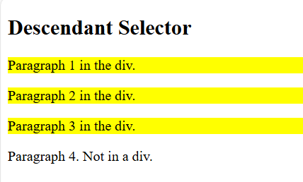
- **Child combinator (>)**

-  Áp dụng chỉ cho phần tử `<p>` là con trực tiếp của `<div>`

```html
<!DOCTYPE html>
<html lang="en">
  <head>
    <meta charset="UTF-8" />
    <meta name="viewport" content="width=device-width, initial-scale=1.0" />
    <title>Document</title>
    <style>
      div>p{
        background-color: yellow;
      }
    </style>
    <link rel="stylesheet" href="Test.css" />
  </head>
  <body>
    <h2>Child Selector</h2>
    <div>
      <p>Paragraph 1 in the div.</p>
      <section><p>Paragraph 3 in the div.</p></section>
      <p>Paragraph 2 in the div.</p>
    </div>
    <p>Paragraph 4. Not in a div.</p>
  </body>
</html>

```
Kết quả:

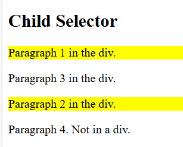

-**Adjacent sibling combinator (+)**
- Áp dụng cho phần tử `<p>` ngay sau một thẻ `<div>` (phải cùng cấp cha)

```html
<!DOCTYPE html>
<html lang="en">
  <head>
    <meta charset="UTF-8" />
    <meta name="viewport" content="width=device-width, initial-scale=1.0" />
    <title>Document</title>
    <style>
      div > p {
        background-color: yellow;
      }
    </style>
    <link rel="stylesheet" href="Test.css" />
  </head>
  <body>
    <div>
      <p>Paragraph 1 in the div.</p>
      <p>Paragraph 2 in the div.</p>
    </div>

    <p>Paragraph 3. After a div.</p>
    <p>Paragraph 4. After a div.</p>

    <div>
      <p>Paragraph 5 in the div.</p>
      <p>Paragraph 6 in the div.</p>
    </div>

    <p>Paragraph 7. After a div.</p>
    <p>Paragraph 8. After a div.</p>
  </body>
</html>
```
Kết quả là:
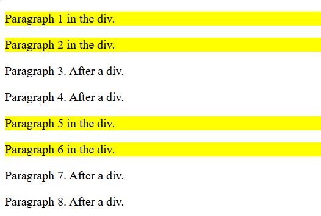
-**General sibling combinator (~)**
Áp dụng cho mọi thẻ `<p>` đứng sau `<div>` (cùng cấp cha), không cần sát nhau

```html
<!DOCTYPE html>
<html lang="en">
  <head>
    <meta charset="UTF-8" />
    <meta name="viewport" content="width=device-width, initial-scale=1.0" />
    <title>Document</title>
    <style>
      div ~ p {
        background-color: yellow;
      }
    </style>
    <link rel="stylesheet" href="Test.css" />
  </head>
  <body>
    <div>
      <p>Paragraph 1 in the div.</p>
      <p>Paragraph 2 in the div.</p>
    </div>

    <p>Paragraph 3. After a div.</p>
    <p>Paragraph 4. After a div.</p>

    <p>Paragraph 7. After a div.</p>
    <p>Paragraph 8. After a div.</p>
  </body>
</html>
```
Kết quả là:
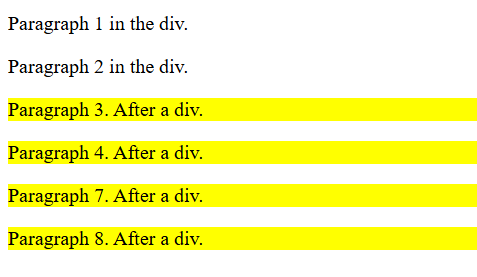
# IX,"Pseudo-elements,Pseudo-classes"
**1, Pseudo-classes (:)**
- Định nghĩa: Pseudo-class là "lớp ảo", áp dụng khi phần tử ở một trạng thái nhất định (hover, focus, visited, vị trí đặc biệt...).
- Vị trí phổ biến:
- 
|Cú pháp|	Ý nghĩa|
|-|-|
:hover|	Khi di chuột vào phần tử|
:active|	Khi phần tử đang được nhấn|
:focus|	Khi phần tử được focus (input, link...)|
:first-child|	Phần tử là con đầu tiên của cha|
:last-child	|Phần tử là con cuối cùng|
:nth-child(n)|	Phần tử là con thứ n|
:not(selector)	|Chọn những phần tử không khớp với selector|

Ví dụ:
```css
a:hover {
  color: red;
}

ul li:first-child {
  font-weight: bold;
}

input:focus {
  border-color: blue;
}

div {
  background-color: green;
  color: white;
  padding: 25px;
  text-align: center;
}
div:hover {
  background-color: blue;
}
p:not(.intro) {
  color: gray;
}
```
kết quả:

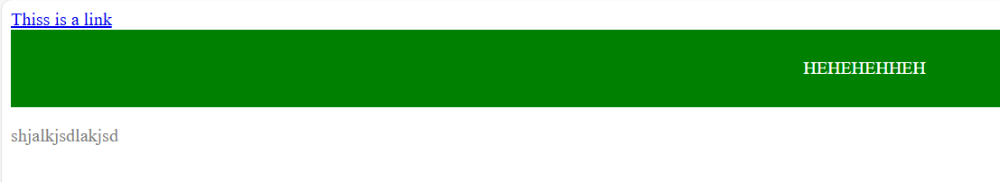
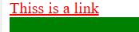
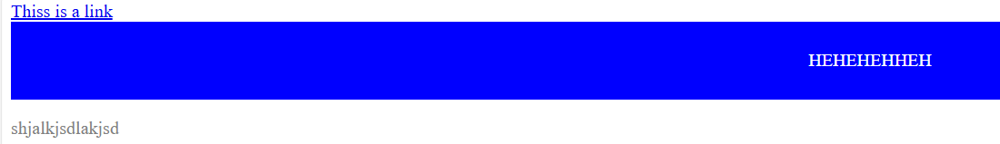

**2, Pseudo-classes (:)**
- Pseudo-element là "phần tử ảo", dùng để tạo hoặc định dạng một phần cụ thể bên trong phần tử thực (ví dụ: chữ đầu dòng, nội dung thêm trước/sau,...)

**Cú pháp**	|**Ý nghĩa**
|-|-|
::before|	Chèn nội dung trước phần tử
::after|	Chèn nội dung sau phần tử
::first-letter|	Định dạng chữ cái đầu tiên trong đoạn
::first-line|	Định dạng dòng đầu tiên trong đoạn văn
::selection|	Định dạng phần văn bản được chọn (bôi đen)

Ví dụ: first-line
```html
<!DOCTYPE html>
<html lang="en">
<head>
  <meta charset="UTF-8">
  <meta name="viewport" content="width=device-width, initial-scale=1.0">
  <title>Document</title>
  <style>
    p::first-line{
      color: aqua;
    }
  </style>
</head>
<body>
  <p>You can use the ::first-line pseudo-element to add a special effect to the first line of a text. Some more text. And even more, and more, and more, and more, and more, and more, and more, and more, and more, and more, and more, and more.</p>
</body>
</html>
```
Kết quả:
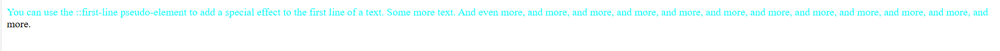

- Còn lại tương tự như ý nghĩa của nó.
# X,Relative & Absolute Units (rem, em, cm, px, ...)

**1. Absolute Units (Đơn vị tuyệt đối)**
- Luôn có kích thước cố định, không phụ thuộc vào trình duyệt, độ phân giải hoặc font cha.
- 
Đơn vị|	Ý nghĩa	|Ghi chú ví dụ
|-|-|-|
px	|Pixel (điểm ảnh)	|Phổ biến nhất, 1px ≈ 1 dot màn hình
cm	|Centimet|	Dựa theo kích thước thực tế in ấn
mm	|Millimet|	Giống cm nhưng nhỏ hơn
in	|Inch	|1in = 2.54cm
pt	|Point (1/72 inch)|	Chủ yếu dùng trong in ấn
pc	|Pica (12pt)|	Cũng dùng trong in ấn
- Dùng trong thiết kế in ấn hoặc khi cần kích thước cố định.
**2. Relative Units (Đơn vị tương đối)**
- Phụ thuộc vào kích thước của phần tử khác (thường là font hoặc viewport).

Đơn vị|	Ý nghĩa|	Ghi chú
|-|-|-|
em|	Dựa trên font-size của phần tử hiện tại|	2em = gấp đôi cỡ chữ hiện tại
rem|	Dựa trên font-size của thẻ `<htmtại>`|	Thường dùng cho responsive, dễ kiểm soát hơn em
em|	Phần trăm so với phần tử tại|	Ví dụ width: 50% = 50% chiều ngang của cha
em|	Viewport width – % chiều rộng cửa sổ trình duyệt|	10vw = 10% chiều ngang của trình duyệt
em|	Viewport height – % chiều cao trình duyệt|	100vh = full height màn hình
vmem|	Nhỏ hơn giữa vw vàtại|	Dùng để làm phần tử luôn nằm trong màn hình
vmem|	Lớn hơn giữa vw và vh	
em|	Chiều rộng của ký tự 0|	Dùng để canh chiều rộng input theo số ký tự
em|	Chiều cao của ký tự x (ít dùng)

# XI,!important
- Quy tắc !important trong CSS được sử dụng để thêm tầm quan trọng cho một thuộc tính/giá trị hơn bình thường.

- Trên thực tế, nếu bạn sử dụng !importantquy tắc, nó sẽ ghi đè TẤT CẢ các quy tắc tạo kiểu trước đó cho thuộc tính cụ thể đó trên phần tử đó!
- Ví dụ:
```html
<!DOCTYPE html>
<html>
  <head>
    <style>
      #myid {
        background-color: rebeccapurple;
      }
      .myclass {
        background-color: aquamarine;
      }
      p {
        background-color: aqua !important;
      }
    </style>
  </head>
  <body>
    <p>
      The ::before pseudo-element inserts content before the content of an
      element.
    </p>
    <p class="myclass">sdkjhskjdfhskjd</p>
    <p id="myid">askjdaidoiuwe</p>
  </body>
</html>
```
Kết quả:
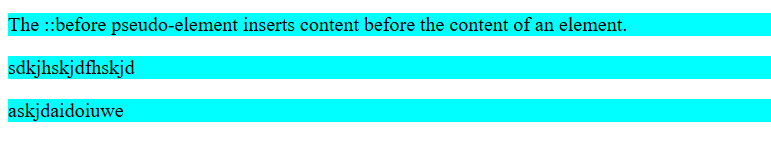

**Quan trọng về !important**
Cách duy nhất để ghi đè một !important quy tắc là thêm một !important quy tắc khác vào một khai báo có cùng độ đặc hiệu (hoặc cao hơn) trong mã nguồn - và vấn đề bắt đầu từ đây! Điều này khiến mã CSS trở nên khó hiểu và việc gỡ lỗi sẽ khó khăn, đặc biệt nếu bạn có một bảng định dạng lớn!

```html
#myid {
  background-color: blue !important;
}

.myclass {
  background-color: gray !important;
}

p {
  background-color: red !important;
}
```
**Có thể có một hoặc hai cách sử dụng hợp lý của !important**
- Một cách sử dụng !importantlà nếu bạn phải ghi đè một kiểu không thể ghi đè theo bất kỳ cách nào khác. Điều này có thể xảy ra nếu bạn đang làm việc trên Hệ thống Quản lý Nội dung (CMS) và không thể chỉnh sửa mã CSS. Khi đó, bạn có thể thiết lập một số kiểu tùy chỉnh để ghi đè một số kiểu CMS.

- Một cách khác để sử dụng !importantlà: Giả sử bạn muốn tất cả các nút trên một trang có giao diện đặc biệt. Ở đây, các nút được thiết kế với nền xám, chữ trắng, cùng một số khoảng đệm và đường viền
# XII,Math Functions
- Các hàm toán học trong CSS cho phép sử dụng các biểu thức toán học làm giá trị thuộc tính. Ở đây, chúng tôi sẽ giải thích các hàm calc(), max()và min().

**The calc() Function**
- Hàm calc() này thực hiện phép tính để sử dụng làm giá trị thuộc tính.
```html
<!DOCTYPE html>
<html>
  <head>
    <style>
      #div1 {
        position: absolute;
        left: 50px;
        width: calc(100% - 500px);
        border: 1px solid black;
        background-color: yellow;
        padding: 5px;
      }
    </style>
  </head>
  <body>
    <h1>The calc() Function</h1>

    <p>
      Create a div that stretches across the window, with a 50px gap between
      both sides of the div and the edges of the window:
    </p>

    <div id="div1">Some text...</div>
  </body>
</html>
```
Kết quả:
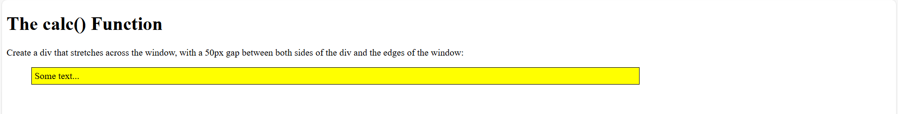
**The max() Function**

- Hàm này max()sử dụng giá trị lớn nhất từ danh sách các giá trị được phân tách bằng dấu phẩy làm giá trị thuộc tính.
```html
<!DOCTYPE html>
<html lang="en">
  <head>
    <meta charset="UTF-8" />
    <meta name="viewport" content="width=device-width, initial-scale=1.0" />
    <title>Document</title>
    <style>
      #div1 {
        background-color: aqua;
        height: 100px;
        width: max(50%, 300px);
      }
    </style>
  </head>
  <body>
    <div id="div1">content...</div>
  </body>
</html>
```
Kết quả:
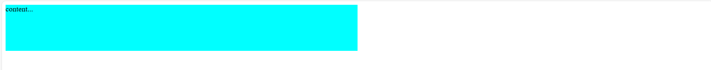
## Hàm MIN tương tự như hàm MAX
# XIII, Variables, Box Sizing, ResetCSS
 1. **CSS Variables (Biến trong CSS)**
    1. Biến giúp bạn tái sử dụng các giá trị như màu sắc, kích thước... trong nhiều nơi trong CSS.
    ```css
    :root {
      --main-color:red;
      --padding: 20px;
    }
    .box {
      color: var(--main-color);
      padding: var(--padding);
    }
    ```

    ```html
    <!DOCTYPE html>
    <html lang="en">
      <head>
        <meta charset="UTF-8" />
        <meta name="viewport" content="width=device-width, initial-scale=1.0" />
        <title>Document</title>
        <link rel="stylesheet" href="Test.css">
      </head>
      <body>
        <div id="div1">content...</div>
        <div class="box">Nguyeenx trong toan</div>
      </body>
    </html>
    ```

    kết quả:

    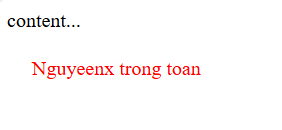

 2. **Box Sizing**
    - Mặc định, CSS tính width/height KHÔNG bao gồm padding và border — điều này đôi khi gây khó chịu.
    - Theo mặc định, chiều rộng và chiều cao của một phần tử được tính như sau:

    - width + padding + border = chiều rộng thực tế của một phần tử
    - height + padding + border = chiều cao thực tế của một phần tử

    - Điều này có nghĩa là: Khi bạn đặt chiều rộng/chiều cao của một phần tử, phần tử đó thường xuất hiện lớn hơn mức bạn đã đặt (vì đường viền và phần đệm của phần tử được thêm vào chiều rộng/chiều cao đã chỉ định của phần tử đó).
    ```html
    <!DOCTYPE html>
    <html>
      <head>
        <style>
          .div1 {
            width: 300px;
            height: 100px;
            border: 1px solid blue;
            box-sizing: border-box;
          }

          .div2 {
            width: 300px;
            height: 100px;
            padding: 50px;
            border: 1px solid red;
            box-sizing: border-box;
          }
        </style>
      </head>
      <body>
        <h1>With box-sizing</h1>

        <div class="div1">Both divs are the same size now!</div>
        <br />
        <div class="div2">Hooray!</div>
      </body>
    </html>
    ```

    - Với thuộc tính box-sizing của CSS
    - Thuộc tính này box-sizingcho phép chúng ta bao gồm phần đệm và đường viền vào tổng chiều rộng và chiều cao của phần tử.

    - Nếu bạn thiết lập box-sizing: border-box;trên một phần tử, phần đệm và đường viền sẽ được bao gồm trong chiều rộng và chiều cao:
  
    Kết quả:
    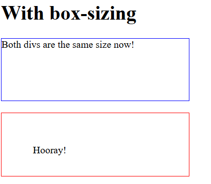

 3. **Reset CSS / Normalize CSS**
    1. Mỗi trình duyệt có kiểu mặc định khác nhau cho HTML. Reset giúp xoá sạch các kiểu mặc định để giao diện hiển thị đồng nhất.
    Ví dụ:
    ```css
    * {
        margin: 0;
        padding: 0;
        box-sizing: border-box;
      }
    ``` 
    - Hoặc dùng file ResetCSS nổi tiếng:
    - Eric Meyer's Reset CSS

    - Normalize.css (phổ biến, giữ lại kiểu hữu ích)
