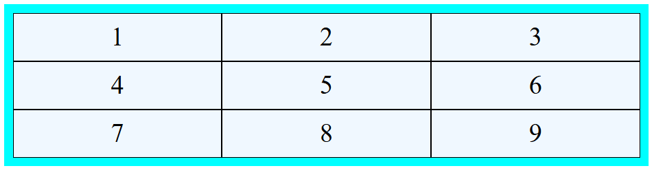
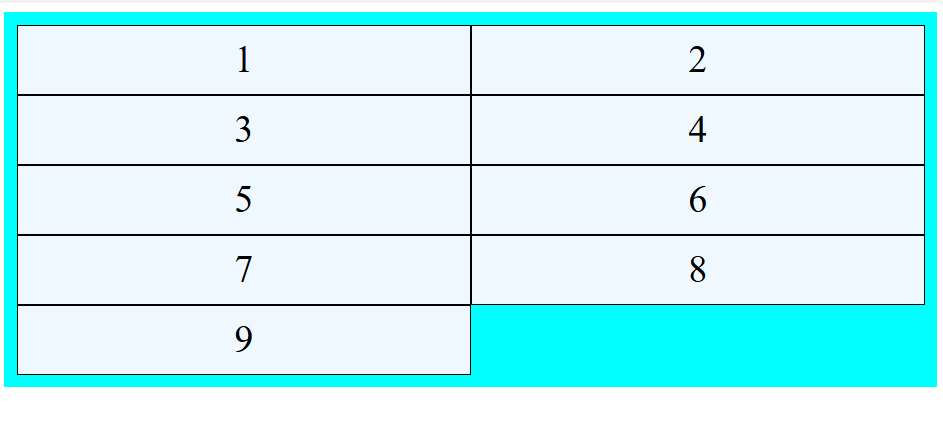
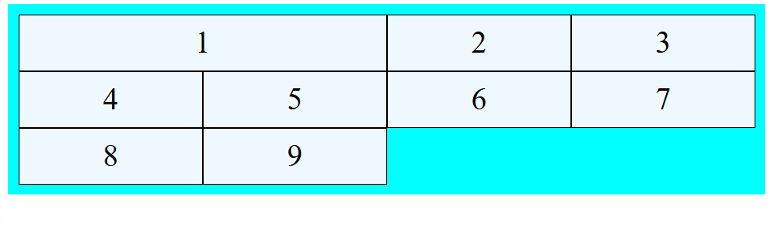

# Buổi 3, CSS 

## Phần 1: Flex,Grid Layout:

### CSS FlexBox là gì:
+ Flexbox là viết tắt của modun Flexible Box Layout.
+ Flexbox là phương pháp bố trí để sắp xếp các mục theo hàng hoặc cột.
+ Flexbox giúp thiết kế cấu trúc bố cục đáp ứng linh hoạt dễ dàng hơn mà không cần sử dụng float hoặc định vị.
### Flexbox so với Grid
+ Bố cục CSS Flexbox nên được sử dụng cho bố cục một chiều, với hàng HOẶC cột.
+ Bố cục lưới CSS nên được sử dụng cho bố cục hai chiều, có hàng VÀ cột.
### CSS Flexible Box Layout Module:
Trước khi có module Bố cục linh hoạt , có bốn chế độ linh hoạt:
+ Block , dành cho các phần trong trang web
+ Inline , dành cho văn bản
+ Table,dành cho dữ liệu bảng 2 chiều
+ Positioned, Để xác định vị trí của các một phần tử
### Thành phần CSS FlexBox:
Một flexbox bao gồm:
+ một **Flex Contrainer**  - the parent (container) `<div>` element
+ **Flex Items** - the Items inside the container `<div>`
### Một flex Container với ba mục Flex
+ Để bắt đầu sử dụng CSS flexbox, trước tiên chúng ta cần phải xác định một vùng chứa flex.
+ Container flex trở nên linh hoạt hơn khi đặt **display** thuộc tính thành flex.

ví dụ:

```html
<!DOCTYPE html>
<html lang="en">
<head>
  <meta charset="UTF-8">
  <meta name="viewport" content="width=device-width, initial-scale=1.0">
  <title>Document</title>
  <style>
    .flex-container{
      display: flex;
      background-color: aqua;
    }
    .flex-container>div{
      margin: 10px;
      padding: 20px;
      background-color: aliceblue;
      font-size: 30px;
    }
  </style>
  
</head>
<body>
  <div class="flex-container">
    <div>1</div>
    <div>2</div>
    <div>3</div>
  </div>
</body>
</html>
```
Kết quả:


Container flex trở nên linh hoạt hơn khi đặt thuộc tính `display` thành `flex`.
Các thuộc tính CSS mà chúng tôi sử dụng cho vùng chứa flex là:
* flex-direction
* flex-wrap
* flex-flow
* justify-content
* align-items
* align-content

**1,flex-direction**
Các giá trị là:
+ row - Thùng chứa sẽ chứa các hàng
+ column - Thùng chứa sẽ chứa các cột
+ row-reverse - Tương tự nhưng ngược lại
+ column-reverse - Tương tự nhưng ngược lại
**2,flex-wrap**
Các giá trị là:
+ nowrap - các phần tử sẽ trên 1 hàng nếu vượt quá sẽ bị co lại, hoặc overflow
+ wrap - cho phép xuống dòng 
+ wrap-reverse - đảo ngược vị trí của các cột hoặc các hàng tùy thuộc vào direction
**3, flex-flow**
+ Thuộc tính này flex-flowlà viết tắt của thuộc tính thiết lập cả hai thuộc tính flex-directionvà flex-wrap.
**4,justify-content**
Thuộc tính này được sử dụng để căn chỉnh các mục flex khi chúng không sử dụng hết không gian có sẵn trên trục chính(theo chiều ngang).
Các giá trị là:
+ center
+ flex-start
+ flex-end
+ space-around - xuất hiện các khoảng trống giữa các flex (đầu và cuối bằng nhau, còn lại chia đều)
+ space-between - Xuất hiện khoảng trống giữa các flex (ở đầu và cuối không có khoảng trống)
+ space-evenly - xuất hiện các khoảng trống có khoảng cách bằng nhau
**5,align-items**
Thuộc tính này align-itemsđược sử dụng để căn chỉnh các mục flex khi chúng không sử dụng hết không gian có sẵn trên trục chéo (theo chiều dọc).
Có các giá trị là:
+ center
+ flex-start
+ flex-end
+ stretch - kéo dài đến hết padding
+ baseline - sẽ được căn chỉnh theo text baseline của flex đầu, text baseline - đường cơ sở văn bản

vì ví dụ này hơi khó hiểu nên mình sẽ lấy ví dụ ở đây:

```html
<!DOCTYPE html>
<html lang="en">
<head>
  <meta charset="UTF-8">
  <meta name="viewport" content="width=device-width, initial-scale=1.0">
  <title>Document</title>
  <style>
    .flex-container{
      display: flex;
      background-color: aqua; 
      height: 200px;
      flex-flow: row nowrap;
      align-items: baseline;
      
    }
    .flex-container>div{
      margin: 10px;
      padding: 20px;
      background-color: aliceblue;
      font-size: 30px;
      width: 50px;
      line-height: 50px;
    }
  </style>
  
</head>
<body>
  <div class="flex-container">
    <div style="font-size: 40px;">Hello</div>
  <div style="font-size: 16px;">World</div>
  </div>
</body>
</html>
```

kết quả là:


**5,align-content**
+ Thuộc tính này align-contentđược sử dụng để căn chỉnh các đường flex.

+ Thuộc tính này align-content tương tự như align-items, nhưng thay vì căn chỉnh các mục flex, nó căn chỉnh các đường flex.
Các giá trị của nó là:
+ center -  các đường flex được đóng gói về phía tâm của thùng chứa:
+ stretch -  các đường flex sẽ kéo dài để chiếm hết không gian còn lại của vùng chứa (đây là mặc định):
+ flex-start - các đường flex được đóng gói về phía đầu của container:
+ flex-end - các đường flex được đóng gói về phía cuối của container:
+ space-around - khoảng cách giữa các dòng bằng nhau trừ đầu bằng cuối
+ space-between - Khoảng cách giữa các dòng bằng nhau nhưng 2 phần đầu không có khoảng cách
+ space-evenly - Khoảng cách giữa các dòng bằng nhau , có 2 phần đầu và cuối

## Phần 2: Grid...

+ Mô-đun Bố cục lưới cung cấp hệ thống bố cục dạng lưới, với các hàng và cột.

+ Mô-đun Bố cục lưới cho phép các nhà phát triển dễ dàng tạo ra các bố cục web phức tạp.

+ Mô-đun Bố cục Lưới giúp thiết kế cấu trúc bố cục đáp ứng dễ dàng hơn mà không cần sử dụng float hoặc định vị.

+ Thuộc tính lưới CSS được hỗ trợ trong tất cả các trình duyệt hiện đại.

### **Lưới so với Flexbox**
+ Bố cục lưới CSS nên được sử dụng cho bố cục hai chiều, có hàng VÀ cột.

+ Bố cục CSS Flexbox nên được sử dụng cho bố cục một chiều, với hàng HOẶC cột.

### CSS Grid Components
Một lưới thường có 2 thành phần:
- a Grid Container - the parent (container) `<div>` element
- Grid Items - the items inside the container `<div>`

### Grid Container and Grid Items
Làm quen với code:

```html
<!DOCTYPE html>
<html lang="en">
<head>
  <meta charset="UTF-8">
  <meta name="viewport" content="width=device-width, initial-scale=1.0">
  <title>Document</title>
  <style>
    .container{
      display: grid;
      background-color: aqua;
      grid-template-columns: auto auto auto;
      padding: 10px;
    }
    .container > div{
      background-color: aliceblue;
      text-align: center;
      padding: 10px;
      font-size: 30px;
      border: 1px solid ;
    }
  </style>
</head>
<body>
  <div class="container">
    <div>1</div>
    <div>2</div>
    <div>3</div>
    <div>4</div>
    <div>5</div>
    <div>6</div>
    <div>7</div>
    <div>8</div>
    <div>9</div>
  </div>
</body>
</html>
```
Kết quả:



tất cả các thuộc tính của Grid:
| Thuộc tính              | Mô tả (Tiếng Việt)                                                                 |
|-------------------------|-------------------------------------------------------------------------------------|
| `align-content`         | Căn toàn bộ lưới theo chiều dọc trong container (khi kích thước lưới nhỏ hơn container) |
| `align-items`           | Căn nội dung trong từng ô lưới theo trục cột (chiều dọc)                          |
| `align-self`            | Căn nội dung cho một ô lưới cụ thể theo trục cột (chiều dọc)                      |
| `display`               | Chỉ định kiểu hiển thị của phần tử (dùng để bật chế độ lưới)                      |
| `column-gap`            | Chỉ định khoảng cách giữa các cột                                                 |
| `gap`                   | Thuộc tính viết tắt cho `row-gap` và `column-gap`                                 |
| `grid`                  | Thuộc tính viết tắt cho `grid-template-rows`, `grid-template-columns`, `grid-template-areas`, `grid-auto-rows`, `grid-auto-columns`, và `grid-auto-flow` |
| `grid-area`             | Đặt tên cho vùng lưới hoặc viết tắt của `grid-row-start`, `grid-column-start`, `grid-row-end`, `grid-column-end` |
| `grid-auto-columns`     | Chỉ định kích thước mặc định của các cột tự động                                  |
| `grid-auto-flow`        | Chỉ định cách các phần tử được tự động chèn vào lưới                              |
| `grid-auto-rows`        | Chỉ định kích thước mặc định của các hàng tự động                                 |
| `grid-column`           | Viết tắt cho `grid-column-start` và `grid-column-end`                             |
| `grid-column-end`       | Xác định vị trí kết thúc của ô lưới theo cột                                      |
| `grid-column-start`     | Xác định vị trí bắt đầu của ô lưới theo cột                                       |
| `grid-row`              | Viết tắt cho `grid-row-start` và `grid-row-end`                                   |
| `grid-row-end`          | Xác định vị trí kết thúc của ô lưới theo hàng                                     |
| `grid-row-start`        | Xác định vị trí bắt đầu của ô lưới theo hàng                                      |
| `grid-template`         | Viết tắt cho `grid-template-rows`, `grid-template-columns`, và `grid-template-areas` |
| `grid-template-areas`   | Xác định cách hiển thị các vùng lưới bằng cách đặt tên cho các ô                  |
| `grid-template-columns` | Chỉ định số lượng và kích thước các cột trong bố cục lưới                         |
| `grid-template-rows`    | Chỉ định số lượng và kích thước các hàng trong bố cục lưới                        |
| `justify-content`       | Căn toàn bộ lưới theo chiều ngang trong container                                 |
| `justify-self`          | Căn nội dung cho một ô lưới cụ thể theo chiều ngang (trục hàng)                   |
| `place-self`            | Viết tắt cho `align-self` và `justify-self`                                       |
| `place-content`         | Viết tắt cho `align-content` và `justify-content`                                 |
| `row-gap`               | Chỉ định khoảng cách giữa các hàng                                                |

Những thuộc tính nên tìm hiểu:
+ grid-template-rows
+ grid-template-columns
+ grid-template-areas
+ grid-auto-rows
+ grid-auto-columns
+ grid-auto-flow

**1,grid-template-row**
+ Thuộc tính này grid-template-rows chỉ định số lượng (và chiều cao) của các hàng trong bố cục lưới.

+ Các giá trị là danh sách được phân tách bằng dấu cách, trong đó mỗi giá trị chỉ định chiều cao của hàng tương ứng.
**2,grid-template-columns**
+ Thuộc tính này grid-template-columnschỉ định số lượng (và chiều rộng) của các cột trong bố cục lưới.

+ Các giá trị là danh sách được phân tách bằng dấu cách, trong đó mỗi giá trị chỉ định kích thước của cột tương ứng.

Ví dụ cho 2 thuộc tính trên:
```html
<!DOCTYPE html>
<html lang="en">
<head>
  <meta charset="UTF-8">
  <meta name="viewport" content="width=device-width, initial-scale=1.0">
  <title>Document</title>
  <style>
    .container{
      display: grid;
      background-color: aqua;
      grid-template-columns: auto auto ;
      grid-template-rows: auto auto;
      padding: 10px;
    }
    .container > div{
      background-color: aliceblue;
      text-align: center;
      padding: 10px;
      font-size: 30px;
      border: 1px solid ;
    }
  </style>
</head>
<body>
  <div class="container">
    <div>1</div>
    <div>2</div>
    <div>3</div>
    <div>4</div>
    <div>5</div>
    <div>6</div>
    <div>7</div>
    <div>8</div>
    <div>9</div>
  </div>
</body>
</html>
```

Kết quả:


**3,grid-template-areas**
Làm cho mục có tên "myarea" trải dài trên hai cột theo bố cục lưới năm cột:

```html
<!DOCTYPE html>
<html lang="en">
<head>
  <meta charset="UTF-8">
  <meta name="viewport" content="width=device-width, initial-scale=1.0">
  <title>Document</title>
  <style>

    .item1{
      grid-area: myarea;
    }

    .container{
      display: grid;
      background-color: aqua;
      grid-template-columns: auto auto auto ;
      grid-template-rows: auto auto;
      grid-template-areas: 'myarea myarea . . ' ; /* Độ ưu tiên cao nhất */
      padding: 10px;
    }
    .container > div{
      background-color: aliceblue;
      text-align: center;
      padding: 10px;
      font-size: 30px;
      border: 1px solid ;
    }
  </style>
</head>
<body>
  <div class="container">
    <div class="item1">1</div>
    <div>2</div>
    <div>3</div>
    <div>4</div>
    <div>5</div>
    <div>6</div>
    <div>7</div>
    <div>8</div>
    <div>9</div>
  </div>
</body>
</html>
```
Kết quả:



**4,grid-template-row**
Đặt kích thước mặc định cho các hàng trong lưới:
grid-auto-rows: 150px;
**5,grid-auto-columns**
Đặt kích thước mặc định cho các cột trong lưới:
grid-auto-columns: 150px;
**6,grid-auto-flow**
Chèn các mục được đặt tự động theo từng cột:
Nó chỉ hoạt động khi mình quy định số hàng trước , nó sẽ xếp theo cột như mình quy định hoặc theo hàng
Ví dụ:
```html
<!DOCTYPE html>
<html lang="en">
<head>
  <meta charset="UTF-8">
  <meta name="viewport" content="width=device-width, initial-scale=1.0">
  <title>Document</title>
  <style>

   
    .container{
      background-color: aqua;
      display: grid;
      grid-auto-flow: column;
      grid-template-rows: auto auto auto;
      grid-auto-columns: 100px;
      grid-auto-rows: 80px;
      height: 300px; /* giới hạn chiều cao để buộc tạo cột mới */
      border: 1px solid black;
    }
    .container > div{
      background-color: aliceblue;
      text-align: center;
      padding: 10px;
      font-size: 30px;
      border: 1px solid ;
    }
  </style>
</head>
<body>
  <div class="container" >
    <div>1</div>
    <div>2</div>
    <div>3</div>
    <div>4</div>
    <div>5</div>
    <div>6</div>
    <div>7</div>
    <div>8</div>
    <div>9</div>
  </div>
</body>
</html>
```
kết quả:


## Phần 3: Z-index, Overflow, Align, Justify
### Z-index
+ Thuộc tính này z-indexchỉ định thứ tự ngăn xếp của một phần tử.

+ Một phần tử có thứ tự ngăn xếp lớn hơn luôn ở phía trước một phần tử có thứ tự ngăn xếp nhỏ hơn.
+ Lưu ý: z-index chỉ hoạt động trên các phần tử được định vị (vị trí: tuyệt đối, vị trí: tương đối, vị trí: cố định hoặc vị trí: cố định) và các mục flex (các phần tử là con trực tiếp của các phần tử display:flex ).

+ Lưu ý: Nếu hai phần tử được định vị chồng lên nhau mà không có z-index chỉ định, phần tử được định vị cuối cùng trong mã HTML sẽ được hiển thị ở trên cùng. 

