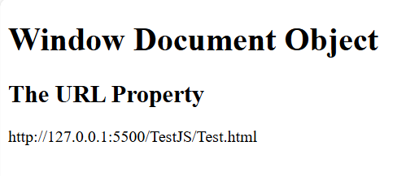

# Buổi 4-Javascript
## Phần 1.Syntax cơ bản JS
### Khai báo dữ liệu, Biến, Toán tử
- Biến và Toán tử thì cũng nhu chúng ta đã từng học
- Ví dụ cơ bản:
```html
<script>
        var tuoi = 20;
        var copytuoi = tuoi;
</script>
```
- Biến **Javascript** có thể được khai báo theo 4 cách:
    + Tự động
    + sử dụng `var`
    + sử dụng `let`
    + sử dụng `const`
Ví dụ sử dụng cả 4 cách trên là
```html
<script>
        x=10;
        y=100;
        var tuoi = 20;
        var copytuoi = tuoi;
        let tuoi1 = 20
        const hehe =199;

        const heeh1 = tuoi+copytuoi
    </script>
```

Khi nào nên sử dụng khai báo từng cách
- Tự động: Luôn khai báo biến
- Luôn sử dụng const nếu giá trị không nên thay đổi
- Luôn sử dụng const nếu kiểu giá trị không thay đổi
- Chỉ sử dụng let nếu bạn không thể sử dụng const
- chỉ sử dụng var nếu bạn phải hỗ trợ trình duyệt cũ

Mã định danh JavaScript
- Tất cả các biến JavaScript phải được xác định bằng tên duy nhất .

- Những tên duy nhất này được gọi là mã định danh .

- Mã định danh có thể là tên viết tắt (như x và y) hoặc tên mô tả chi tiết hơn (tuổi, tổng, tổng khối lượng).

- Các quy tắc chung để xây dựng tên cho các biến (mã định danh duy nhất) là:

  + Tên có thể chứa chữ cái, chữ số, dấu gạch dưới và dấu đô la.
  + Tên phải bắt đầu bằng một chữ cái.
  + Tên cũng có thể bắt đầu bằng $ và _ (nhưng chúng ta sẽ không sử dụng trong hướng dẫn này).
  + Tên phân biệt chữ hoa và chữ thường (y và Y là các biến khác nhau).Không thể sử dụng các từ dành riêng (như từ khóa JavaScript) làm tên.

Một số tính chất mới:

#### I

Nếu bạn khai báo lại một biến JavaScript được khai báo bằng var, thì giá trị của nó sẽ không bị mất.

Biến carNamevẫn sẽ có giá trị "Volvo" sau khi thực hiện các câu lệnh sau:

Ví dụ:
```html
<script>
    var carName = "Volvo";
    var carName;
    document.getElementById("demo").innerHTML = carName;
</script>
```

Ghi chú
+ Bạn không thể khai báo lại một biến được khai báo bằng lethoặc const.

+ Điều này sẽ không hiệu quả:
+ 
```js
    let carName = "Volvo";
    let carName;
```
#### II

Nếu bạn đặt một số trong dấu ngoặc kép, các số còn lại sẽ được coi là chuỗi và được nối lại.
ví dụ
```js
let x = 2 + 3 +"5";
```

Trong Javascript thì dấu `$` và `_` cũng được xem là 1 kí tự
tuy nhiên:
+ việc sử dụng ký hiệu đô la không phổ biến trong JavaScript, nhưng các lập trình viên chuyên nghiệp thường sử dụng nó như một bí danh cho hàm chính trong thư viện JavaScript.
+ Việc sử dụng dấu gạch dưới không phổ biến trong JavaScript, nhưng một quy ước giữa các lập trình viên chuyên nghiệp là sử dụng nó như một bí danh cho các biến "riêng tư (ẩn)".

- sử dụng biến in ra màn hình:
```html
<script>
    var bien = "Nguyen trong toan"
    document.write(bien)
</script>
```
- Nếu muốn nhập dữ liệu từ màn hình thì sao
- chúng ta có ví dụ:

```html
<script>
    var bien = "Nguyen trong toan"
    bien = window.prompt("Hãy nhập tên của bạn:")
    document.write(bien)
</script>
```
Về Toán tử:
có các loại toán tử
+ Toán tử số học:
  + Cũng như các toán tử chúng ta đã học, chỉ khác ở mũ, trong js, Mũ là:`**`;
+ Toán tử gán: `=`, `+=`, ...
+ Toán tử so sánh:

| Toán tử                 | Mô tả (Tiếng Việt)                                        |
| ----------------------- | --------------------------------------------------------- |
| `==`                    | bằng nhau (so sánh giá trị, **không so sánh kiểu**)       |
| `===`                   | bằng nhau cả về giá trị **và kiểu dữ liệu**               |
| `!=`                    | không bằng nhau (so sánh giá trị, **không so sánh kiểu**) |
| `!==`                   | không bằng nhau về giá trị **hoặc** kiểu dữ liệu          |
| `>`                     | lớn hơn                                                   |
| `<`                     | nhỏ hơn                                                   |
| `>=`                    | lớn hơn hoặc bằng                                         |
| `<=`                    | nhỏ hơn hoặc bằng                                         |
| `?`                     | toán tử ba ngôi – dùng để viết điều kiện rút gọn          |

+ Toán tử logic: `&&`,`|`,`!`
+ Toán tử bit: 

| Toán tử | Chú thích        |
| ------- | ---------------- |
| &       | and              |
|         |                  | or |
| ~       | not              |
| ^       | xor              |
| <<      | dịch trái        |
| >>      | dịch phải        |
| >>>     | dịch phải 2 bước |

### Vòng lặp:
Vòng lặp của JS thì cũng tương tự như C++

Ví dụ:
```html
<script>
        var x =2
        var y =3
        var tuoi ;
        tuoi = window.prompt("Hay nhập số tuổi vào:")
        for(var i=0;i<10;i++){
            document.write("Năm nay em:" , tuoi++ ,"tuổi<br>")    
        }
</script>
```
### Array, Object, String

#### Object

+ Object cũng là biến. Nhưng đối tượng có thể chứa nhiều giá trị.
+ Đoạn mã này gán nhiều giá trị cho mội đối tượng có tên là co_hang_xom:
```html
<script>
        const co_hang_xom ={
            tuoi:18,
            ten: "Nguyen Van A",
            dia_chi: "123 Duong ABC, Quan XYZ",
            honnhan: false
        };
        document.write("Tuoi: " + co_hang_xom.tuoi + "<br>");
    </script>
```
Cách khai báo khác chẳng hạn
```html
<script>
        const co_hang_xom = new Object();
        co_hang_xom.tuoi = 18;
        co_hang_xom.ten = "Nguyen Van A";   
        co_hang_xom.dia_chi = "123 Duong ABC, Quan XYZ";
        co_hang_xom.honnhan = false;
        document.write("Tuoi: " + co_hang_xom.tuoi + "<br>");
</script>
```
+ Một cách làm phổ biến là khai báo đối tượng bằng từ khóa const.

#### Function

+ Một hàm JavaScript được định nghĩa bằng function từ khóa, theo sau là tên , tiếp theo là dấu ngoặc đơn () .

+ Tên hàm có thể chứa chữ cái, chữ số, dấu gạch dưới và dấu đô la (quy tắc giống như biến).

+ Dấu ngoặc đơn có thể bao gồm tên tham số được phân tách bằng dấu phẩy:
( tham số1, tham số2, ... )

+ Mã được thực thi bởi hàm được đặt bên trong dấu ngoặc nhọn: {}

Input của function

Ví dụ đối với hàm không có tham số:
```html
<script>
        var tinh_tuoi = function(){
            var tuoi = prompt("Nhap vao nam sinh cua ban");
            tuoi = 2025 - tuoi;
            document.write("Tuoi cua ban la: " + tuoi + "<br>");
        }
        tinh_tuoi();    
</script>
```
Ví dụ đối với hàm có tham số:
```html
<script>
        var tinh_tuoi = function(tuoi){
            // var tuoi = prompt("Nhap vao nam sinh cua ban");
            tuoi = 2025 - tuoi;
            document.write("Tuoi cua ban la: " + tuoi + "<br>");
        }
        tinh_tuoi(2005); // Gọi hàm với tham số là năm sinh
</script>
```
Output của function
```html
<script>
        var tinh_tuoi = function(tuoi){
            // var tuoi = prompt("Nhap vao nam sinh cua ban");
            tuoi = 2025 - tuoi;
            // document.write("Tuoi cua ban la: " + tuoi + "<br>");
            return tuoi; // Nếu không có return thì hàm sẽ mặc định trả về undefine
        }
        document.write("tuổi của bạn là " + tinh_tuoi(2005)); // Gọi hàm với tham số là năm sinh
</script>
```
#### Array

Nó là kiểu list, dùng để lưu các danh sách

ví dụ
```js
var a =[1, 2, 3, 4, 5];
```
+ indet được tính từ 0
+ về bản chất thì array vẫn là object thì nó các thuộc tính
Ví dụ về một số thuộc tính:
```html
<script>
        var a= ["lanh", "do", "vang", "trang", "den"]; // khai báo array chứa các string tên
        document.write(a.length);// số phần tử của array
        document.write(a);
        document.writeln("<br>");
        a.push("xanh");// thêm phần tử vào cuối array
        a.push("tim");
        document.writeln(a);
        document.writeln("<br>");
        a.pop() // xóa phần tử cuối của array
        a[2]= "vangcopy";
        document.writeln(a);
</script>
```
Lưu ý:
Trong các thành phần của Array nó có thể khác nhau về **Kiểu dữ liệu**

#### String

+ Nó cũng tương tự gần giống với array
+ String là kiểu dữ liệu nguyên thủy, nhưng có các thuộc tính giống array
```js
    var s = "Xin chao cac ban";
    document.write(s.length);
```
### Array Method: Map, Reduce, Filter, Includes, Group, Some, Every

#### Map
+ map() tạo một mảng mới bằng cách gọi một hàm cho mỗi phần tử mảng.

+ map() không thực thi hàm đối với các phần tử rỗng.

+ map() không thay đổi mảng ban đầu.

Ví dụ 1:
```html
    <p id="demo"></p>
    <script>
        const numbers = [4, 9, 16, 25, 36];
        document.getElementById("demo").innerHTML = numbers.map(Math.sqrt).join(", ");
    </script>
```
Ví dụ 2:
```html
    <p id="demo"></p>
    <script>
        const numbers = [4, 9, 16, 25, 36];
        document.getElementById("demo").innerHTML = numbers.map(myFuction).join(", ");
        function myFuction(value) {
            return value*value;
        }
    </script>
```
#### Reduce
+ Phương thức reduce() thực thi một hàm reducer cho các phần tử mảng.
+ Phương thức reduce() trả về một giá trị duy nhất: kết quả tích lũy của hàm.
+ Phương thức reduce() không thực thi hàm cho các phần tử mảng rỗng.
+ Phương thức reduce() không thay đổi mảng ban đầu.

```html
<script>
const numbers = [175, 50, 25];
document.getElementById("demo").innerHTML = numbers.reduce(myFunc);

function myFunc(total, num) {
  return total - num;
}
```


``` giải thích code
2 số đầu tiên 175-20=125
tiếp theo là kết quả của 2 số đầu tiên và số tiếp the0
125-25=100
```

```html
<script>
const numbers = [15.5, 2.3, 1.1, 4.7];

document.getElementById("demo").innerHTML = numbers.reduce(getSum, 0);

function getSum(total, num) {
  return total + Math.round(num);
}
</script>
```

Giải thích code, ở code bên trên thì không có giá trị khởi tạo nhưng ở code này thì khởi tạo giá trị bằng 0

#### Filter
Phương thức filter() tạo một mảng mới chứa các phần tử vượt qua bài kiểm tra do một hàm cung cấp.

Phương thức filter() không thực thi hàm đối với các phần tử rỗng.

Phương thức filter() không thay đổi mảng ban đầu.

Ví dụ:

```html
<script>
const ages = [32, 33, 16, 40];

document.getElementById("demo").innerHTML = ages.filter(checkAdult);

function checkAdult(age) {
  return age >= 18;
}
```

### Includes
Phương thức includes() trả về true nếu mảng chứa một giá trị được chỉ định.

Phương thức includes() trả về false nếu không tìm thấy giá trị.

Phương thức includes() phân biệt chữ hoa chữ thường.
Ví dụ:
<p id="demo"></p>

<script>
const fruits = ["Banana", "Orange", "Apple", "Mango"];
document.getElementById("demo").innerHTML = fruits.includes("Mango");
</script>
kết quả: trả về true

Ví dụ 2:
```html
<script>
const fruits = ["Banana", "Orange", "Apple", "Mango"];
document.getElementById("demo").innerHTML = fruits.includes("Banana", 3);
</script>
```

Giải thích code:
kiểm tra xem Banana có xuất hiện từ vị trí số 3 hay không.

#### Some
Phương thức some() kiểm tra xem có phần tử mảng nào vượt qua bài kiểm tra (được cung cấp dưới dạng hàm gọi lại) hay không.

Phương thức some() thực thi hàm gọi lại một lần cho mỗi phần tử mảng.

Phương thức some() trả về true (và dừng) nếu hàm trả về true cho một trong các phần tử mảng.

Phương thức some() trả về false nếu hàm trả về false cho tất cả các phần tử mảng.

Phương thức some() không thực thi hàm cho các phần tử mảng rỗng.

Phương thức some() không thay đổi mảng ban đầu.

Ví dụ: 
```html
<script>
const ages = [3, 10, 18, 20];
document.getElementById("demo").innerHTML = ages.some(checkAdult);

function checkAdult(age) {
  return age > 18;
}
</script>
```

Kết quả: trả về boolen.

#### every
Phương thức every() thực thi một hàm cho mỗi phần tử mảng.

Phương thức every() trả về true nếu hàm trả về true cho tất cả các phần tử.

Phương thức every() trả về false nếu hàm trả về false cho một phần tử.

Phương thức every() không thực thi hàm cho các phần tử rỗng.

Phương thức every() không thay đổi mảng ban đầu

Ví dụ
```js
const ages = [32, 33, 16, 40];

// Function to Run for every Element
function checkAge(age) {
  return age > 18;
}
```
kết quả trả về flase, vì có 1 phần tử là 16 không thỏa mãn điều kiện
### Callback và HighOrder Function
+ Higher-order là hàm có hoạt động dựa trên một hàm khác, tức là: nó có thể nhận hàm làm tham số đầu vào, hoặc sẽ trả về một hàm khác. Một trong hai điều kiện đó xảy ra thì được gọi là hàm Higher-order.
+ Callback là hàm được truyền vào một hàm khác như một tham số đầu vào, sau đó sẽ được gọi kích hoạt bên trong hàm khác này.

```js
function mapArrayString2Length(array,countLegth){
    var result = [];
    var i;
    var length = array.length;
    for(i = 0; i < length; i++){
        result.push(countLegth(array[i]));
    }
}

function countLegth(value){
    return value.length;
}
```

Như ta thấy được, hàm mapArrayString2Length() có nhận một tham số là hàm (countLength()), như vậy hàm mapArrayString2Length() được gọi là hàm Higher-order. Ngoài ra hàm countLength() được truyền và sử dụng trong hàm mapArrayString2Length(), nên được gọi là hàm Callback.

**Callback** hoạt động như thế nào?
Sự khác biệt khi ta gọi đến định nghĩa của một hàm và khi ta gọi để thực thi hàm đó là cặp dấu ngoặc (). Giả sử ta có hàm sau
```js
function doSomething() {
 // Do something
}
```
Khi ta gọi doSomething() nghĩa là ta đang gọi để thực thi hàm đó . Vì thế , trong Higher-order. khi ta truyền vào đối số là một hàm, ta chỉ truyền vào định nghĩa của hàm (không có dấu ngoặc). Khi có định nghĩa của hàm rồi, thì Higher-order muốn sử dụng Callback lúc nào cũng được (bằng cách gọi hàm có cặp dấu ngoặc).

## Phần 2: JS6
### let, var, const: Định nghĩa, phân biệt
#### Var
`var` là cách khai báo biến đầu tiên và đã tồn tại từ khi JavaScript ra đời. Tuy nhiên nó có 1 số đặc điểm mà đôi khi có thể gây ra các lỗi khó lường trong ứng dụng lớn.

Cú pháp và sử dụng var

```js
var loichao = "Hello, World!";
var count = 0;
var isAvaliblr = true;

var x = 10,y = 20;

var result 
```

Đặc điểm của var

**1.Function scope**
Biến được khái báo bằng `var` có phạm vi (scope) là function chứa nó, hoặc globan scope nếu được khai báo ngoài function.

```js
function demoVarScope() {
    var message = "Bên trong function";
    console.log(message); // "Bên trong function"
}

demoVarScope();
// console.log(message); // Lỗi: message is not defined

// Ví dụ về global scope
var globalVar = "Tôi là biến toàn cục";
function accessGlobal() {
    console.log(globalVar); // "Tôi là biến toàn cục"
}
```
**2.Hoisting**
var có đặc tính hoisting - nghĩa là khai báo biến được "đưa lên" đầu phạm vi của nó, nhưng không phải giá trị.    
```js
console.log(hoistedVar); // undefined (không lỗi)
var hoistedVar = "Tôi đã được hoisted";
console.log(hoistedVar); // "Tôi đã được hoisted"

// Tương đương với:
var hoistedVar;          // Khai báo được hoisted
console.log(hoistedVar); // undefined
hoistedVar = "Tôi đã được hoisted"; // Gán giá trị
console.log(hoistedVar); // "Tôi đã được hoisted"
```  
**3.Có thể khai báo lại**
Biến var có thể được khai báo lại mà không gây lỗi:
```js
var user = "Nam";
console.log(user); // "Nam"

var user = "Hoa"; // Không có lỗi khi khai báo lại
console.log(user); // "Hoa"
```
**4.Không có block scope**
var không có phạm vi khối (block scope), nghĩa là nó có thể được truy cập từ bên ngoài các khối lệnh như if, for, while:
```js
if (true) {
    var blockVar = "Tôi nằm trong block";
}
console.log(blockVar); // "Tôi nằm trong block" - truy cập được từ bên ngoài block

for (var i = 0; i < 3; i++) {
    // Xử lý gì đó
}
console.log(i); // 3 - biến i vẫn tồn tại và có thể truy cập sau vòng lặp
```

#### Let
Từ khóa let được giới thiệu trong ES6 để khắc phục một số vấn đề của var, đặc biệt là vấn đề về phạm vi.
Cú pháp thì tương tự var, chỉ thay từ khóa `var` bằng `let`
#### Đặc điểm của let
**1.Block scope**
```js
if (true) {
    let blockScoped = "Tôi chỉ tồn tại trong block này";
    console.log(blockScoped); // "Tôi chỉ tồn tại trong block này"
}
// console.log(blockScoped); // Lỗi: blockScoped is not defined

for (let i = 0; i < 3; i++) {
    // i chỉ tồn tại trong vòng lặp for
}
// console.log(i); // Lỗi: i is not defined
```
**2. Hoisting có giới hạn**
let cũng được hoisted, nhưng khác với var, biến let không được khởi tạo với giá trị undefined. Nếu bạn cố gắng truy cập biến trước khi nó được khai báo, bạn sẽ gặp lỗi "Temporal Dead Zone" (TDZ).
```js
// console.log(tdz); // Lỗi: Cannot access 'tdz' before initialization
let tdz = "Temporal Dead Zone demo";
```

**3.Không thể khai báo lại**
```js
let user = "Nam";
// let user = "Hoa"; // Lỗi: Identifier 'user' has already been declared

// Tuy nhiên, có thể khai báo lại trong phạm vi khác
if (true) {
    let user = "Hoa"; // Hợp lệ, đây là biến khác trong phạm vi khác
    console.log(user); // "Hoa"
}
console.log(user); // "Nam"
```
**4. Có thể cập nhật giá trị**
Biến được khai báo bằng let có thể được gán lại giá trị:
```js
let counter = 1;
counter = 2; // Hợp lệ
console.log(counter); // 2
```
#### const - Khai báo hằng số không thay đổi
Cú pháp và cách sử dụng
```js
const PI = 3.14159;
const APP_NAME = "My JavaScript App";
const IS_DEVELOPMENT = true;

// Khai báo object hoặc array với const
const user = { name: "Nam", age: 30 };
const colors = ["red", "green", "blue"];
```
#### Đặc điểm của scope
**1.Block Scope**
Giống như let, biến const có phạm vi là khối lệnh (block).
**2.Hoisting**
const cũng có hoisting giống như let, với Temporal Dead Zone.
**3.Không thể khai báo lại**
Giống let, không thể khai báo lại biến const trong cùng một phạm vi.
**4.Không thể gán lại giá trị**
Điểm khác biệt giữa let và const là biến `const` không thể gán lại được giá trị sau khi khai báo:
```js
const API_VERSION = "v1";
// API_VERSION = "v2"; // Lỗi: Assignment to constant variable
```
Tuy nhiên cần lưu ý rằng const chỉ ngăn chặn việc gán lại biến , chứ không phải làm cho giá trị của nó bất biến.
**Không bất biến với objects và arrays**
Với các kiểu dữ liệu tham chiếu như objects và arrays, const chỉ ngăn chặn việc gán lại biến đó cho một object/array khác, nhưng không ngăn chặn việc thay đổi thuộc tính hoặc phần tử bên trong:
```js
const user = { name: "Nam", age: 30 };
user.age = 31; // Hợp lệ
user.role = "Developer"; // Hợp lệ, thêm thuộc tính mới
console.log(user); // { name: "Nam", age: 31, role: "Developer" }

// Nhưng không thể gán lại biến user
// user = { name: "Hoa", age: 25 }; // Lỗi: Assignment to constant variable

const numbers = [1, 2, 3];
numbers.push(4); // Hợp lệ
numbers[0] = 0; // Hợp lệ
console.log(numbers); // [0, 2, 3, 4]

// Nhưng không thể gán lại biến numbers
// numbers = [5, 6, 7]; // Lỗi: Assignment to constant variable
```
### Arrow function, từ khóa this
#### Arrow function
Các hàm mũi tên cho phép chúng ta viết cú pháp hàm ngắn hơn:
ví dụ:
```js
let myFunction = (a,b) => a**b;
document.getElementById("demo").innerHTML = myFunction(2,3);
```
**Trước mui tên**
```js
hello = function() {
  return "Hello World!";
}
```
**Với chức năng mũi tên:**
```js
hello = () => {
  return "Hello World!";
}
```
Nó sẽ ngắn hơn! Nếu hàm chỉ có một câu lệnh và câu lệnh trả về một giá trị, bạn có thể bỏ dấu ngoặc và từ return khóa:
```js
hello = () => "Hello World!";
```
#### This
Cách xử lý thiscũng khác nhau trong các hàm mũi tên so với các hàm thông thường.

Tóm lại, với các hàm mũi tên không có ràng buộc nào this.

Trong các hàm thông thường, thistừ khóa biểu thị đối tượng gọi hàm, có thể là cửa sổ, tài liệu, nút hoặc bất kỳ thứ gì.

Với các hàm mũi tên, thistừ khóa luôn biểu thị đối tượng đã định nghĩa hàm mũi tên.

Chúng ta hãy xem xét hai ví dụ để hiểu sự khác biệt.

Cả hai ví dụ đều gọi một phương thức hai lần, lần đầu khi trang tải và lần thứ hai khi người dùng nhấp vào nút.

Ví dụ đầu tiên sử dụng hàm thông thường và ví dụ thứ hai sử dụng hàm mũi tên.

Kết quả cho thấy ví dụ đầu tiên trả về hai đối tượng khác nhau (cửa sổ và nút), và ví dụ thứ hai trả về đối tượng cửa sổ hai lần, vì đối tượng cửa sổ là "chủ sở hữu" của hàm.
Ví dụ:
```js
<button id="btn">Click Me!</button>

<p id="demo"></p>

<script>
let hello = "";

hello = () => {
  document.getElementById("demo").innerHTML += this;
}

//The window object calls the function:
window.addEventListener("load", hello);

//A button object calls the function:
document.getElementById("btn").addEventListener("click", hello);
```

Ví dụ 2
```js
<button id="btn">Click Me!</button>

<p id="demo"></p>

<script>
let hello = "";

hello = function() {
  document.getElementById("demo").innerHTML += this;
}

//The window object calls the function:
window.addEventListener("load", hello);

//A button object calls the function:
document.getElementById("btn").addEventListener("click", hello);
```
### Template Literals
Template Literals (chuỗi mẫu) là cách viết chuỗi mới trong JavaScript, sử dụng dấu **backtick ()** thay vì dấu nháy đơn 'hoặc nháy đôi"`.

Nó giúp:

+ Chèn biến dễ dàng

+ Xuống dòng thoải mái

+ Viết chuỗi dài gọn gàng

Cú pháp cơ bản:
```js
`Nội dung chuỗi với biến: ${ten_bien}`
```
Cách cũ:
```js
let name = "Toàn"
let message ="Xin chào" + name + "!";
console.log(message);
```

Cách mới:
```js
let name = "Toàn"
let message = `Xin chào,${name}!`;
console.log(message);
```
### Destructuring, Rest Parameter, Spread
**1. Destructuring (Phân rã)**
 Dùng để “rút gọn” việc gán giá trị từ array hoặc object.

Ví dụ: Array Destructuring
```js
let arr = [1, 2, 3];
let [a, b, c] = arr;

console.log(a); // 1
console.log(b); // 2
```
Ví dụ:Rest trong Destructuring
```js
let person = { name: "Toàn", age: 21 };
let { name, age } = person;

console.log(name); // Toàn
console.log(age);  // 21
```
**2.Rest Parameter (...) – gom phần còn lại**
Dùng để gom nhiều phần tử còn lại thành một mảng, thường dùng trong hàm hoặc destructuring.
Ví dụ: Hàm nhận số đối số không giới hạn
```js
function sum(...numbers) {
  return numbers.reduce((total, num) => total + num, 0);
}

console.log(sum(1, 2, 3, 4)); // 10
```
Ví dụ:Rest trong Destructuring
```js
let [first, ...rest] = [10, 20, 30, 40];
console.log(first); // 10
console.log(rest);  // [20, 30, 40]
```
**3.Spread Operator (...) – trải mảng hoặc object ra**
Dùng để “trải” phần tử của array/object → tiện để copy, merge, truyền tham số.

**Spread với array:**
```js
let arr1 = [1, 2];
let arr2 = [...arr1, 3, 4]; // Trải arr1 ra
console.log(arr2); // [1, 2, 3, 4]
```
**Spread với object:**
```js
let obj1 = { name: "Toàn" };
let obj2 = { ...obj1, age: 21 };
console.log(obj2); // { name: "Toàn", age: 21 }
```
### Module
Module JS là file riêng biệt có thể:

+ export (xuất) biến / hàm / class

+ import (nhập) vào file khác để sử dụng

Ví dụ cấu trúc
```
project/
├── index.html
├── math.js      <-- module chứa hàm
└── main.js      <-- file chính
```
**math.js – export ra hàm**
```js
// math.js
export function add(a, b) {
  return a + b;
}
export const PI = 3.14;
```
**main.js – import vào dùng**

```js
// main.js
import { add, PI } from "./math.js";

console.log(add(2, 3));    // 5
console.log(PI);           // 3.14
```

```html
<!DOCTYPE html>
<html>
<head>
  <meta charset="UTF-8">
  <title>Module Demo</title>
</head>
<body>
  <h1>JavaScript Module</h1>

  <script type="module" src="main.js"></script> 
</body>
</html>
```
Lưu ý: phải dùng **type = "module"** trong thẻ script

**Export Default (1 file chỉ có 1 export default)**

Ví dụ:
```js
// utils.js
export default function greet(name) {
  return `Hello, ${name}`;
}
```
```js
// main.js
import greet from "./utils.js";
console.log(greet("Toàn")); // Hello, Toàn
```
## Phần 3 DOM

một ví dụ về Cơ chế Dom:

```html
<!DOCTYPE html>
<html lang="en">
<head>
    <meta charset="UTF-8">
    <meta name="viewport" content="width=device-width, initial-scale=1.0">
    <title>Document</title>
</head>
<body>
    Nhập tên:
    <input type="" name="" id="inputName" value="">
    <br>
    <button onclick="sayhello()">ok</button>

    <script>
        var sayhello = function(){
            var ten = document.getElementById("inputName").value;
            var loi_chao = "Xin chào " + ten;
            alert(loi_chao);
            document.write(loi_chao);
        }
    </script>
</body>
</html>
```
### HTML DOM
HTML DOM cho phép javascript thay đổi nội dung của các phần tử HTML
Cách dễ nhất để sửa đổi nội dung của một phần tử HTML là sử dụng innerHTMLthuộc tính.

Để thay đổi nội dung của một phần tử HTML, hãy sử dụng cú pháp này:
```js
document.getElementById(id).innerHTML = new HTML
```

Ví dụ này thay đổi nội dung của một `<p>` phần tử:

```html
<html>
    <body>
        <p id="p1">Hello World!</p>
        <script>
            document.getElementById("p1").innerHTML = "New text!";
        </script>
    </body>
</html>
```
Giải thích:
Tài liệu HTML ở trên chứa một `<p>`phần tử vớiid="p1"

Chúng tôi sử dụng HTML DOM để lấy phần tử với id="p1"

JavaScript sẽ thay đổi nội dung ( innerHTML) của phần tử đó thành "New text!"

Ví dụ này thay đổi nội dung của một `<h1>`phần tử:

```html
<!DOCTYPE html>
<html>
<body>

<h1 id="id01">Old Heading</h1>

<script>
const element = document.getElementById("id01");
element.innerHTML = "New Heading";
</script>

</body>
</html>
```
Thay đổi giá trị của một thuộc tính:

Để thay đổi giá trị của một thuộc tính HTML,hãy sử dụng cú pháp này:

document.getElementById(id).attribute = new value

Ví dụ này thay đổi giá trị của thuộc tính src của một `` phần tử:

```html
<!DOCTYPE html>
<html>
<body>


<script>
document.getElementById("myImage").src = "landscape.jpg";
</script>

</body>
</html>
```

#### Dynamic HTML content

```html
<!DOCTYPE html>
<html>
<body>

<p id="demo"></p>

<script>
document.getElementById("demo").innerHTML = "Date : " + Date();
</script>

</body>
</html> 
```
JavaScript có thể tạo nội dung HTML động 
Như code bên trên là có thể lấy ra ngày giờ năm...

#### document.write()
Trong JavaScript, document.write()có thể được sử dụng để ghi trực tiếp vào luồng đầu ra HTML 

Ví dụ: em đã dùng rất nhiều bên trên rồi.

### DOM API

DOM API là tập hợp các phương thức (functions) cho phép JavaScript:

+ Truy cập phần tử HTML

+ Thay đổi nội dung, thuộc tính, CSS

+ Tạo hoặc xoá phần tử

+ Xử lý sự kiện (click, nhập liệu, v.v.)

1, Truy cập phần tử HTML

✅ getElementById()
```js
let title = document.getElementById("main-title");
```
✅ getElementsByClassName()
```js
let items = document.getElementsByClassName("item"); // trả về HTMLCollection
```
✅ getElementsByTagName()
```js
let allDivs = document.getElementsByTagName("div");
```
✅ querySelector() (trả về phần tử đầu tiên)
```js
let firstInput = document.querySelector("input[type='text']");
```
✅ querySelectorAll() (trả về tất cả các phần tử khớp)
```js
let allButtons = document.querySelectorAll("button");
```

2,Thay đổi nội dung

```js
element.innerHTML = "Nội dung mới";     // Có thể chứa HTML
element.innerText = "Chỉ text thôi";    // Không chứa HTML
```

3, Thay đổi thuộc tính và CSS
```js
element.setAttribute("href", "https://example.com");
element.style.color = "red";
element.style.fontSize = "20px";
```
4,Tạo, thêm và xoá phần tử
```js
let newP = document.createElement("p");
newP.innerText = "Đoạn văn mới";

document.body.appendChild(newP);              // Thêm vào cuối
document.body.insertBefore(newP, oldElement); // Thêm trước element khác
document.body.removeChild(newP);              // Xoá
```
5, Gắn sự kiện (event)
```js
let btn = document.getElementById("clickMe");
btn.addEventListener("click", function() {
  alert("Bạn vừa click!");
});
```
### DOM Document Object
Khi một tài liệu HTML được tải vào trình duyệt web, nó sẽ trở thành một  document object.

+ The document object is the root node of the HTML document.

+ The document object is a property of the window object.

+ The document object is accessed with:
  `window.document` or just `document`

Ví dụ:
```html
<!DOCTYPE html>
<html>
<body>

<h1>Window Document Object</h1>
<h2>The URL Property</h2>

<p id="demo"></p>

<script>
let url = window.document.URL;
document.getElementById("demo").innerHTML = url;
</script>

</body>
</html>
```
Kết quả:



## DOM Attribute

### Mục đích:
Làm việc với thuộc tính (attributes) của thẻ HTML như `href`, `src`, `value`, `id`,...

### Ví dụ:
```javascript
let link = document.getElementById("myLink");

// Lấy giá trị thuộc tính
console.log(link.getAttribute("href"));

// Đặt lại giá trị thuộc tính
link.setAttribute("href", "https://example.com");

// Xoá thuộc tính
link.removeAttribute("target");
```

---

## DOM CSS

### Mục đích:
Thay đổi CSS thông qua thuộc tính `.style`.

### Ví dụ:
```javascript
let box = document.getElementById("box");

box.style.backgroundColor = "lightblue";
box.style.width = "200px";
box.style.border = "1px solid black";
```

---

## DOM Events

### Mục đích:
Gắn xử lý sự kiện cho các phần tử (click, input, mouseover...).

### Ví dụ:
```javascript
let btn = document.getElementById("btn");

btn.addEventListener("click", function() {
  alert("Bạn vừa click!");
});
```

---

##  `innerText`, `textContent`, `innerHTML`

| Thuộc tính      | Mô tả |
|------------------|------|
| `innerText`     | Lấy nội dung hiển thị (ẩn nếu `display: none`) |
| `textContent`   | Lấy toàn bộ text, kể cả text ẩn |
| `innerHTML`     | Lấy/chèn nội dung HTML (bao gồm cả thẻ HTML con) |

### Ví dụ:
```html
<div id="test">
  <b>Hello</b> <span style="display:none">World</span>
</div>
```

```javascript
let el = document.getElementById("test");

console.log(el.innerText);    // "Hello"
console.log(el.textContent);  // "Hello World"
console.log(el.innerHTML);    // "<b>Hello</b> <span style='display:none'>World</span>"
```

---

##  `preventDefault()` và `stopPropagation()`

### `preventDefault()`
Ngăn hành vi mặc định (ví dụ: không cho form submit).
```javascript
document.getElementById("form").addEventListener("submit", function(e) {
  e.preventDefault(); // không reload trang
  console.log("Form chưa được gửi đi");
});
```

### `stopPropagation()`
Ngăn sự kiện lan lên cha (bubbling).
```javascript
document.getElementById("child").addEventListener("click", function(e) {
  e.stopPropagation();
  alert("Chỉ click child thôi!");
});
```

---

## Các phương thức `get element`

| Phương thức                    | Mô tả |
|-------------------------------|------|
| `getElementById(id)`          | Lấy 1 phần tử theo id |
| `getElementsByClassName(cls)` | Trả về HTMLCollection |
| `getElementsByTagName(tag)`   | Trả về HTMLCollection |
| `querySelector(selector)`     | Trả về phần tử đầu tiên khớp |
| `querySelectorAll(selector)`  | Trả về tất cả phần tử khớp (NodeList) |

### Ví dụ:
```javascript
let div = document.getElementById("main");
let items = document.getElementsByClassName("item");
let allDivs = document.querySelectorAll("div.container");
```

---

## Event Listener

### Thêm sự kiện bằng `addEventListener()`
```javascript
let btn = document.getElementById("btn");

btn.addEventListener("click", () => {
  console.log("Đã click!");
});
```

### Gỡ sự kiện
```javascript
function handleClick() {
  alert("Clicked!");
}

btn.addEventListener("click", handleClick);

// Sau đó gỡ:
btn.removeEventListener("click", handleClick);
```

---

## Ghi nhớ:

- `innerHTML` cho phép chèn **thẻ HTML** vào.
- `preventDefault()` dùng khi bạn muốn chặn hành vi mặc định (submit, mở link...).
- `stopPropagation()` hữu ích khi làm menu, modal, hoặc các sự kiện lồng nhau.
