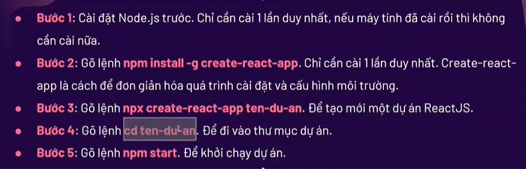
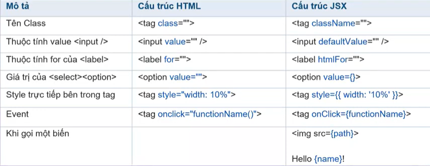
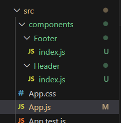
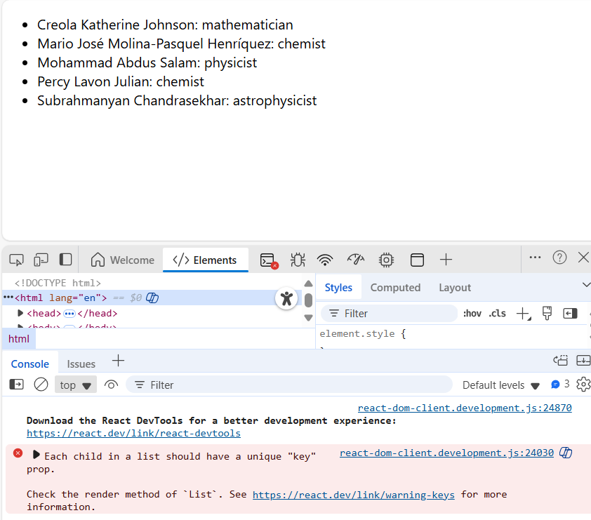
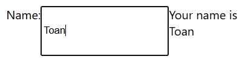
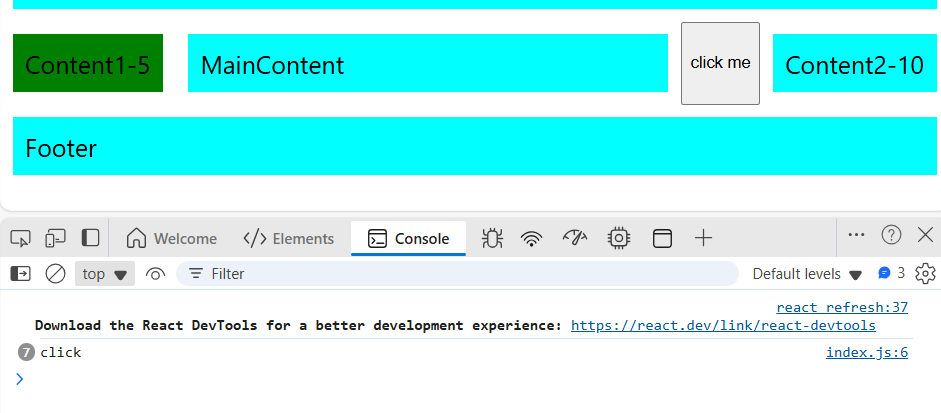
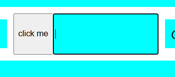
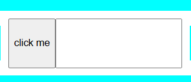
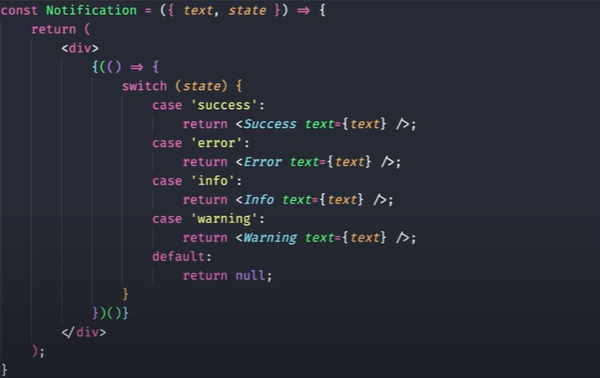
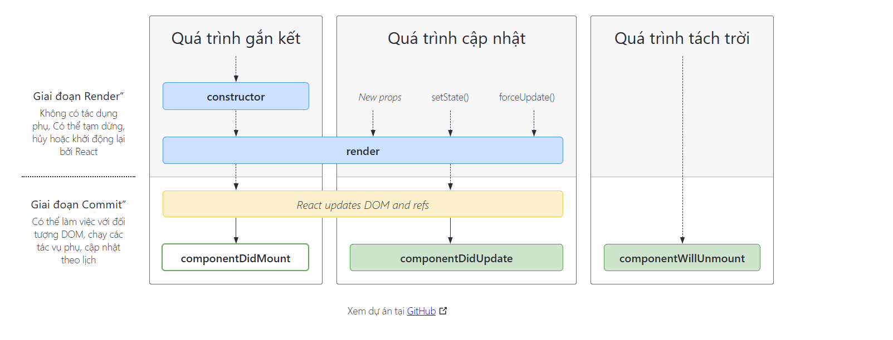

# Buổi6: REACT
## Phần 1: cài đặt môi trường , kiến thức cơ bản về React
### Giới Thiệu về React:

React.js là một thư viện Javascript đang nổi lên trong những năm gần đây với xu hướng Single Page Application. Trong khi những framework khác cố gắng hướng đến một mô hình MVC hoàn thiện thì React nổi bật với sự đơn giản và dễ dàng phối hợp với những thư viện Javascript khác. Nếu như AngularJS là một Framework cho phép nhúng code javasscript trong code html thông qua các attribute như ng-model, ng-repeat...thì với react là một library cho phép nhúng code html trong code javascript nhờ vào JSX, bạn có thể dễ dàng lồng các đoạn HTML vào trong JS.Tích hợp giữa javascript và HTML vào trong JSX làm cho các component dễ hiểu hơn

**REACT là gì:**
* React là một thư viện UI phát triển tại Facebook để hỗ trợ việc xây dựng những thành phần (components) UI có tính tương tác cao, có trạng thái và có thể sử dụng lại được. React được sử dụng tại Facebook trong production, và www.instagram.com được viết hoàn toàn trên React.

* Một trong những điểm hấp dẫn của React là thư viện này không chỉ hoạt động trên phía client, mà còn được render trên server và có thể kết nối với nhau. React so sánh sự thay đổi giữa các giá trị của lần render này với lần render trước và cập nhật ít thay đổi nhất trên DOM.

**Lợi ích của React**
+ Độ hót
+ Cộng đồng lớn
+ Khả năng mở rộng tốt, tái sử dụng cao
+ Hiệu suất cao
+ Phát triển nhanh chóng
+ Khả năng tương thích ngước
+ Tương lai sáng

**Cách cài đặt môi trường React**


**Vite và sự khác biệt so với React**
| Tiêu chí        | **Vite**                                                                | **React**                                          |
| --------------- | ----------------------------------------------------------------------- | -------------------------------------------------- |
| Loại            | Công cụ build + Dev server                                              | Thư viện UI                                        |
| Chức năng chính | Chạy server khi dev, bundle code khi build                              | Xây dựng và quản lý UI                             |
| Tốc độ          | Rất nhanh khi start và reload (nhờ ES Modules + Hot Module Replacement) | Không liên quan đến tốc độ dev server              |
| Ngôn ngữ hỗ trợ | Nhiều framework: React, Vue, Svelte, Vanilla JS…                        | Chỉ dành cho UI (thường kết hợp với công cụ build) |
| Khi dùng chung  | Vite đóng vai trò **nền tảng chạy** và build cho app React              | React đóng vai trò **viết UI**                     |

**CLI TOOLS**

**1,LI Tools**

+ CLI = Command Line Interface → Công cụ chạy bằng dòng lệnh.

+ CLI Tools là những chương trình bạn cài vào máy để gõ lệnh (trong terminal) nhằm tạo, cấu hình, và quản lý dự án.

Ví dụ:

+ npx create-react-app my-app (tạo dự án React)

+ npm create vite@latest my-vite-app (tạo dự án Vite)

Lợi ích:

+ Tự động tạo cấu trúc thư mục.

+ Cài sẵn các file cấu hình phức tạp (webpack, vite config…).

+ Giúp bạn bắt đầu code ngay mà không phải setup thủ công.

Là một CLI Tool chính thức của React team để tạo dự án React nhanh chóng.

**2,Create React App (CRA)**

Cài và chạy ví dụ:

```
npx create-react-app my-app
cd my-app
npm start
```

Ưu điểm:

Dễ dùng, phổ biến.

Không cần biết về cấu hình Webpack ban đầu.

Nhược điểm:

Start server hơi chậm khi dự án lớn.

Build chậm hơn so với Vite.


**3,Vite**

Cũng là CLI Tool (của Evan You, creator của Vue).

Có thể dùng với React, Vue, Svelte… không giới hạn framework.

Tạo và chạy dự án React với Vite:
```
npm create vite@latest my-vite-app
cd my-vite-app
npm install
npm run dev
```
Ưu điểm:

+ Cực nhanh khi start và reload (nhờ ES Modules + HMR).

+ Build nhẹ và tối ưu hơn CRA.

Nhược điểm:

+ Không phải công cụ "chính thức" của React, nhưng vẫn rất phổ biến hiện nay.
## JSX
+ JSX là viết tắt của JavaScriptXML
+ Nó cho phép bạn viết các đoạn mã HTML trong ReactJS một cách dễ dàng và có cấu trúc
+ Một số khác biết giữa HTMl và JSX:



Ví dụ dùng JS
```jsx
// import logo from './logo.svg';
import './App.css';

function App() {
  let name = "Nguyen trong toan";
  const css ={
    color: "red",
    backgroundColor:"blue"
  };
  return (
    <div className="test" style={css}>
      Xin chao {name}!
    </div>
  );
}

export default App;
```
Lưu ý:
+ Trong JSX chỉ viết được 1 element cha bọc ở bên ngoài.
+ Để viết được 2 element cha thì chúng ta dùng cú pháp **Fragment**
+ Cú Pháp:<></>

## Components
+ Components(Thành phần)Giúp chia các UI (Giao diện người dùng) thành **các phần nhỏ** để dễ dàng quản lí và tái sử dụng.
+ Ví dụ:header,footer,sidebar,...
+ Các bước tạo 1 component trong ReactJS:
  + Bước 1: Trong folder src tạo một folder mới tên là Components
  + Bước 2: Trong Folder đó , đặt tên đúng theo ý nghĩa của nó.
  + Bước 3: Tạo 1 file mới đặt tên là index.js . Sau đó viết 1 fuction tên là Header và export default.
  + Bước 4: Import vào file mà bạn muốn sử dụng component đó.

Ví dụ một chương trình :


```jsx
import './App.css';
import Header from './components/Header';
import Footer from './components/Footer';
function App() {
  let name = "Nguyen Trong Toan";
  const css = {
    color: "red",
    backgroundColor: "blue",
    padding: "10px"
  };

  return (
    <>
      <Header />
      <Footer />
      <div className="test" style={css}>
        Xin chào {name}!
      </div>
      <div className="test" style={css}>
        Xin chào {name}!
      </div>
    </>
  );
}
export default App;
```

## List, Key

### Rendering Lists:
* Chúng ta thưởng sử dụng filter()và map()với React để lọc và chuyển đổi mảng dữ liệu thành một mảng các thành phần.

* Sau đây là một ví dụ ngắn về cách tạo danh sách các mục từ một mảng:


Giả sử bạn có một danh sách nội dung.
```js
<ul>
  <li>Creola Katherine Johnson: mathematician</li>
  <li>Mario José Molina-Pasquel Henríquez: chemist</li>
  <li>Mohammad Abdus Salam: physicist</li>
  <li>Percy Lavon Julian: chemist</li>
  <li>Subrahmanyan Chandrasekhar: astrophysicist</li>
</ul>
```


1. Di chuyển Data và một mảng
```js
const people = [
  'Creola Katherine Johnson: mathematician',
  'Mario José Molina-Pasquel Henríquez: chemist',
  'Mohammad Abdus Salam: physicist',
  'Percy Lavon Julian: chemist',
  'Subrahmanyan Chandrasekhar: astrophysicist'
];
```
2. Ánh xạ các thành viên của people vào một mảng mới với các nút JSX listItems:
```js
const listItems = people.map(person => <li>{person}</li>);
```
3. Return listItems từ thành phần của bạn được gói trong `<ul>`:
```js
return <ul>{listItems}</ul>;
```

sau đây là kết quả:


```js
import './App.css';
import Header from './components/Header';
import Footer from './components/Footer';


function List() {
  let name = "Nguyen Trong Toan";
  const css = {
    color: "red",
    backgroundColor: "blue",
    padding: "10px"
  };


  const people = [
    'Creola Katherine Johnson: mathematician',
    'Mario José Molina-Pasquel Henríquez: chemist',
    'Mohammad Abdus Salam: physicist',
    'Percy Lavon Julian: chemist',
    'Subrahmanyan Chandrasekhar: astrophysicist'
  ];


  const listIteams = people.map(people => <li>{people}</li>);

  return (
    <>
      <ul>
        {listIteams}
      </ul>
    </>
  );
}
export default List;
```


Tiếp theo cùng đến cấu trúc chi tiết hơn nữa:
```js
const people = [{
  id: 0,
  name: 'Creola Katherine Johnson',
  profession: 'mathematician',
}, {
  id: 1,
  name: 'Mario José Molina-Pasquel Henríquez',
  profession: 'chemist',
}, {
  id: 2,
  name: 'Mohammad Abdus Salam',
  profession: 'physicist',
}, {
  id: 3,
  name: 'Percy Lavon Julian',
  profession: 'chemist',  
}, {
  id: 4,
  name: 'Subrahmanyan Chandrasekhar',
  profession: 'astrophysicist',
}];
```
Giả sử bạn đang muốn tìm cách hiển thị những người có nghề nghiệp là 'chemist' . Bạn có thể sử dụng phương thức `filter()`  để trả về những người đó.
Cách thực hiện là
```js
const listItems = person.filter(preson =>)
```

Ví dụ:

```js
import './App.css';
import Header from './components/Header';
import Footer from './components/Footer';


function List() {
  let name = "Nguyen Trong Toan";
  const css = {
    color: "red",
    backgroundColor: "blue",
    padding: "10px"
  };


  const people = [{
  id: 0,
  name: 'Creola Katherine Johnson',
  profession: 'mathematician',
}, {
  id: 1,
  name: 'Mario José Molina-Pasquel Henríquez',
  profession: 'chemist',
}, {
  id: 2,
  name: 'Mohammad Abdus Salam',
  profession: 'physicist',
}, {
  id: 3,
  name: 'Percy Lavon Julian',
  profession: 'chemist',  
}, {
  id: 4,
  name: 'Subrahmanyan Chandrasekhar',
  profession: 'astrophysicist',
}];

  const chemist = people.filter(people => people.profession=='chemist');
  const listIteams =chemist.map(people => <li>
    <p>
      <b>
        {people.name}:
      </b>
      {' '+personalbar.profession+' '}
    </p>
  </li>);

  return (
    <>
      <ul>
        {listIteams}
      </ul>
    </>
  );
}
export default List;
```

### Key

Keeping list items in order with key

* Ở ví dụ trên ta thấy lỗi:
* Warning: Each child in a list should have a unique “key” prop.

Ta cần cung cấp cho mỗi mục mảng một key - mộit chuỗi hoặc một số để xác định duy nhất mục đó trong số các mục khác trong mảng đó:
```js
<li key={person.id}>...</li>
```
**Note** 
```
Các Phần tử JSX trực tiếp bên trong map lệnh luôn gọi cần có khóa!.
```
Thay vì tạo khóa ngay lập tức , chúng ta nên đưa chúng vào dữ liệu của mình:

Ví dụ ở trên...

**Nơi để có đượckey**
Các nguồn dữ liệu khác nhau cung cấp các nguồn khóa khác nhau:

Dữ liệu từ cơ sở dữ liệu: Nếu dữ liệu của bạn đến từ cơ sở dữ liệu, bạn có thể sử dụng khóa/ID cơ sở dữ liệu, vốn có tính chất duy nhất.
Dữ liệu được tạo cục bộ: Nếu dữ liệu của bạn được tạo và lưu trữ cục bộ (ví dụ: ghi chú trong ứng dụng ghi chú), hãy sử dụng bộ đếm tăng dần crypto.randomUUID()hoặc gói như uuidkhi tạo mục.

**Quy tắc của chìa khóa**

Khóa phải là duy nhất giữa các nút anh em. Tuy nhiên, bạn có thể sử dụng cùng một khóa cho các nút JSX trong các mảng khác nhau .
Khóa không được thay đổi , nếu không sẽ làm mất tác dụng của khóa! Không tạo khóa khi render.

**Tại sao React lại cần khóa?**

Hãy tưởng tượng các tệp trên màn hình nền của bạn không có tên. Thay vào đó, bạn sẽ gọi chúng theo thứ tự — tệp đầu tiên, tệp thứ hai, v.v. Bạn có thể quen dần, nhưng một khi xóa một tệp, mọi thứ sẽ trở nên khó hiểu. Tệp thứ hai sẽ trở thành tệp đầu tiên, tệp thứ ba sẽ trở thành tệp thứ hai, v.v.

Tên tệp trong thư mục và khóa JSX trong mảng có mục đích tương tự nhau. Chúng cho phép chúng ta xác định duy nhất một mục giữa các phần tử cùng cấp. Một khóa được chọn kỹ lưỡng sẽ cung cấp nhiều thông tin hơn vị trí trong mảng. Ngay cả khi vị trí thay đổi do sắp xếp lại, khóa keyJSX vẫn cho phép React xác định mục đó trong suốt vòng đời của nó.
## Props

+ Các thành phần **React** sử dụng **Props** đê giao tiếp với nhau. Mỗi thành phần cha có thể truyền một số thông tin cho các thành phần con bằng cách gán Props cho chúng.**Props** có thể gợi nhớ đến các thuộc tính HTML, Nhưng bạn có thể truyền bất kì 
giá trị JS nào qua chúng ,bao gồm các đối tượng , mảng , hàm.

+ Cách truyền một props cũng giống như cách mà bạn thêm một atributes cho một Element HTML
+ Props có thể nhận giá trị là tất cả kiểu dữ liệu:
  + Kiểu dữ liệu nguyên thủy: string , Number ,Boolean , UnderFined , NULL,Symbol
  + Kiểu dữ liệu phức tạp : function, Object.

### Familiar props
Props là thông tin bạn truyền vào thẻ JSX. Ví dụ như : className , src , alt , width , và height là một số `Props` bạn có thể truyền vào thẻ ``:
Ví dụ:
```jsx
function Avatar() {
  return (
    
  );
}

export default Avatar 
```

**Bước 1:**

**Truyền Props cho một thành phần**
Trước tiên, ta truyền 2 props cho Avatar. Ví dụ: truyền 2 Props: `person`(một đối tượng) và `size` một số:
```jsx
export default function App() {
  return (
    <Avatar 
      person={{ name: 'Toan', imageId: 'q9q23j' }} 
      size={100} 
    />
  );
}
```
**Bước 2:**

Đọc các Props bên trong Chill Component

```jsx
function Avatar({person,size}) {
  return (
    <>
      <p>{person.name}</p>
      <p>Size: {size}</p>
    </>
  );
}
```
### State

+ State(components is memory) 
  + Giúp component biết nó đang kiểm soát thông tin gì(keep track of informations)
  + Thực hiện thay đổi tương ứng khi có sự tương tác của người dùng 

+ useStatelà React Hook cho phép bạn thêm biến trạng thái vào thành phần của mình.

Ví dụ:
```jsx
const [state,setState] = useState(initialState)
```
Ví dụ cụ thể:
```jsx
import { useState } from "react"


function MainContent(){
    const [name,setName] = useState("");
    return(
        <>
        <div className="box">MainContent</div>
        <label>Name:</label>
        <input type="text" 
        onChange={(event) => setName(event.target.value)} 
        value={name}
        />
        <div>Your name is {name}</div>
        </>
    )
}
export default MainContent
```

Kết quả:


## Handing Event
- Xử lí các sự kiện trong React rất giống với xử lí các sự kiện trong JS , nhưng có một số khác biệt về cú pháp
- Các sự kiện trong React được đặt tên bằng camelCase, thay vì chữ thường.
- Một số sự kiện phổ biến trong ReactJS:
  - onclick
  - onChange
  - onSubmit
  - onFocus
  - onBlur

Ví dụ:
```jsx
function MainContent(){
    const handleClick = (e) =>{
        console.log(e.type);
    }
    return(
        <>
        <div className="box">MainContent</div>
        <button onClick={handleClick}>click me</button>
        </>
    )
}
export default MainContent
```

Kết quả:



Ví dụ 2:

```js

function MainContent(){
    const handleClick = (e) =>{
        console.log(e.type);
    }
    const handleFocus = (e) =>{
        e.target.classList.add("input-active");
        console.log(e.target);
    }
    const handleBlur =(e) =>{
        e.target.classList.remove("input-active");
    }
    return(
        <>
        <div className="box">MainContent</div>
        <button onClick={handleClick}>click me</button>
        <input className="input" onFocus={handleFocus} onBlur={handleBlur}/>
        
        </>
    )
}
export default MainContent
```
Khi ta focus:



Khi ta Blur:



## Conditional Rendering
+ là việc hiển thị nội dung khác nhau trong giao diện người dùng dựa trên các điều kiện cụ thể.
+ Trong React, Có thể sử dụng cấu trúc điều kiện để thực hiện hóa conditional Rendering
  
Ví dụ cơ bản:

```jsx
import { useState } from "react"

function Header() {
  const [isLoggedIn,SetisLoggedIn] = useState(false);
  return (
    <>
      <div className="box">Header</div>
      <nav>
        <ul>
          <li>Logo</li>
        </ul>
        <ul className="ml-auto">
          {
            isLoggedIn ?(<li>Toan</li>) :(<li>Login</li>)
          }
        </ul>
      </nav>
    </>
  )
}

export default Header
```
Nó giống như If Else vậy

Cách Triển Khai:
+ Sử dụng if else 
  + Ví dụ:
  ```jsx
  function ListTodos({todos}){
      if(!todos){
          return null
      }
      return(
          <>
          <div>
              {todos.map(item => <div>{item.title}</div>)}
          </div>
          </>
      )
  }
  export default ListTodos;
  ```
+ Sử dụng toán tử 3 ngôi:
  Ví dụ ở trên
+ Logical && operator

Ví dụ:
```jsx
const LoadingSpiner = ({isloading}) =>{
  return (
    <div>
      {isLoading && <p>Loading...</p>}
    </div>
  )
}
```
+ Switch case



## PHẦN 2: LIFE CYCLE
### Life Cycle 

Trong React, mỗi component đều có một “vòng đời” (lifecycle) với ba giai đoạn chính:

+ **Mounting (Gắn lên DOM)** — khi component được tạo và hiển thị lần đầu.

+ **Updating (Cập nhật**) — khi component được re-render do thay đổi props hoặc state.

+ **Unmounting (Tháo khỏi DOM)** — khi component bị loại bỏ và cần làm sạch (cleanup) tài nguyên.

Mỗi giai đoạn có các phương thức đặc biệt (lifecycle methods) được gọi để bạn có thể thêm logic phù hợp ở từng thời điểm. 




Được chứ 👍 mình sẽ viết lại toàn bộ phần giải thích bằng **Markdown** để bạn copy dễ dàng:

---

# React Hooks

## 1. Vì sao lại có **Hooks**?

Trước đây React có 2 loại component:

* **Function Component**: chỉ return JSX, **không có state hay lifecycle**.
* **Class Component**: có state (`this.state`) và lifecycle (`componentDidMount`, `componentDidUpdate`, ...).

👉 Vấn đề:

* Class component thường phức tạp, code dài.
* Khó tái sử dụng logic (ví dụ nhiều component đều fetch data).
* Lifecycle methods bị chồng chéo, dễ rối.

👉 Giải pháp:
React 16.8 (2019) giới thiệu **Hooks** để:

* Dùng state và lifecycle trong function component.
* Viết code ngắn gọn, dễ tái sử dụng.
* Không cần class nữa, function + hooks đã đủ.

---

## 2. Các Hooks cơ bản

### 🔹 `useState`

Dùng để **quản lý state** trong function component.

```jsx
import React, { useState } from "react";

function Counter() {
  const [count, setCount] = useState(0);  // count: giá trị, setCount: hàm cập nhật

  return (
    <div>
      <p>Bạn đã click {count} lần</p>
      <button onClick={() => setCount(count + 1)}>Click me</button>
    </div>
  );
}
```

📌 Giải thích:

* `useState(0)` khởi tạo state `count = 0`.
* `setCount` để thay đổi giá trị.
* Mỗi lần gọi `setCount`, React sẽ re-render component.

---

### 🔹 `useEffect`

Dùng để **xử lý side effects** (gọi API, setInterval, thao tác DOM, ...).
Thay thế cho các lifecycle như `componentDidMount`, `componentDidUpdate`, `componentWillUnmount`.

```jsx
import React, { useState, useEffect } from "react";

function Timer() {
  const [count, setCount] = useState(0);

  useEffect(() => {
    console.log("Component render hoặc cập nhật");
  });

  return (
    <div>
      <p>Count: {count}</p>
      <button onClick={() => setCount(count + 1)}>Tăng</button>
    </div>
  );
}
```

---

### Các biến thể của `useEffect`

1. **Chạy mỗi lần render**:

```jsx
useEffect(() => {
  console.log("Luôn chạy khi render");
});
```

2. **Chạy 1 lần khi mount (giống `componentDidMount`)**:

```jsx
useEffect(() => {
  console.log("Chạy 1 lần khi component mount");
}, []);
```

3. **Chạy khi dependency thay đổi**:

```jsx
useEffect(() => {
  console.log("Chạy khi count thay đổi");
}, [count]);
```

4. **Cleanup (giống `componentWillUnmount`)**:

```jsx
useEffect(() => {
  const timer = setInterval(() => {
    console.log("Tick...");
  }, 1000);

  // cleanup
  return () => {
    clearInterval(timer);
    console.log("Component unmount -> clear timer");
  };
}, []);
```

---

## 3. Tóm gọn

* `useState`: quản lý dữ liệu động (state).
* `useEffect`: xử lý side effects & lifecycle.
* Hooks giúp function component làm được tất cả những gì class component có thể làm, nhưng code **ngắn gọn và dễ hiểu hơn**.

---

👉 Bạn có muốn mình viết thêm một **so sánh class component vs function component (dùng hooks)** với cùng một ví dụ (ví dụ Counter hoặc Fetch API) để bạn thấy rõ sự khác biệt không?

