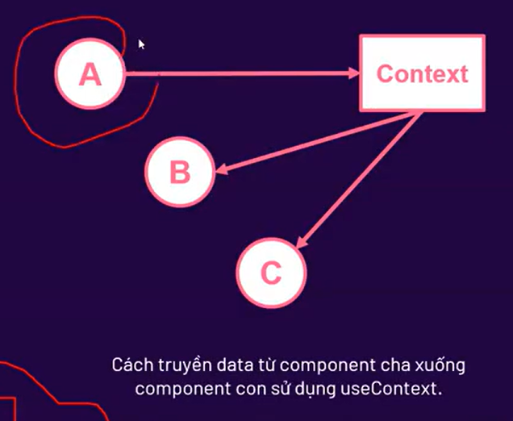
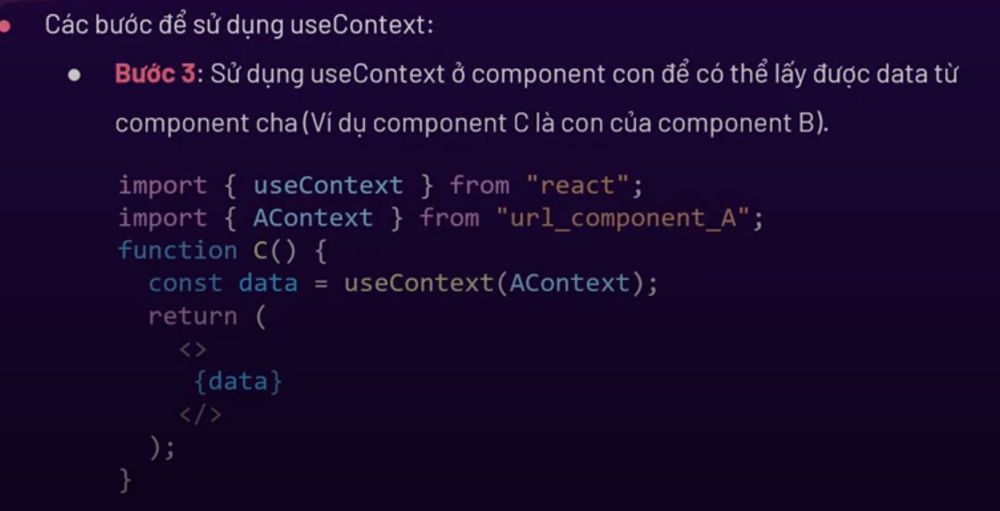

# Buổi 7: Hook ( gắn vào, móc vào)
## UseState 
+ **useState** giúp cập nhật lại trạng thái của dữ liệu (hay cập nhật lại giá trị của dữ liệu)
+ Khi dữ liệu thay đổi thì giao diện được cập nhật lại theo dữ liệu mới
+ Một vài ví dụ trong thực tế:
  + Bóng đèn có 2 trạng thái là bật hoặc tắt
  + Trạng thái đã đăng nhập hoặc chưa đăng nhập vào tài khoản
  + Khi tăng số lượng sản phẩm thì tổng tiền chưa được cập nhật lại.
## UsedEffect 
+ **useEffect** dùng để **xử lý logic** nào đó khi khi data được thay đổi
+ Component sau khi được render ra giao diện lần đầu , thì sẽ gọi tới hàm callback của useEffect ( vì chúng ta ưu tiên việc render ra giao diện trước, xử lí logic sau nên callBack của UseEffect sẽ chạy sau khi component được render ra).
+ Cú pháp:
    ```jsx
    useEffect(callback,[dependency]);
    ```
+ Trong đó:
  + **callback**: làm hàm gọi lại, bắt buộc phải có.
  + **dependency**: là một biến . Không bắt buộc phải có.

### TH1.useEffect(callback)
+ khi render lại giao diện (tức render lần 2 trở đi), thì callback của useEffect vẫn được gọi lại.
+ Ví dụ: querySelectorAll các item trong DOM

```jsx
import { useEffect } from "react";

function UseEffect1() {

    
    useEffect( () =>{
        let listItem = document.querySelectorAll("ul")
        console.log(listItem);
    })
    return(
        <>
        <ul>
            <li>Mục 1</li>
            <li>Mục 2</li>
            <li>Mục 3</li>
        </ul>
        </>
    )
}
export default UseEffect1;
```
### TH2.useEffect(callback,[])

+ Ví dụ: useEffect(callback,[])
+ Khi render lại giao diện(tức là lần 2 trở đi) thì **callback** của useEffect không được gọi lại.
+ Thường áp dụng cho gọi API 1 lần để lấy dữ liệu.

### TH3.useEffect(callback,[dependency])
+ Khi render Lại giao diện (tức render lần 2 trở đi), thì callback của useEffect được gọi lại khi dependency thay đổi
+ Ví dụ: Phân trang

## UseContext
+ UseContext (bối cảnh) giúp đơn giản hóa việc chuyển dữ liệu từ component cha xuống các component con mà không cần sử dụng đến props
+ Tức là chuyển trực tiếp từ component cha xuống các component con mà không cần phải thông qua 1 component gián tiếp.

Hình ảnh minh Họa:



+ Các bước để sử dụng useContext:
  + Bước 1: Tạo ra một bối cảnh ở component A(để tạo ra phạm vi và sử dụng được data trong phạm vi đó, ví dụ phạm vi là component A thì tất cả các component con đều sử dụng được).
  
  ```jsx
  import {creatContext} from "react";
  exprort const AContext = creatContent();
  ```
  + Bước 2: Cung cấp bối cảnh  để bao bọc toàn bộ các component cần sử dụng data
  ```jsx
  function A(){
    return(
        <AContext.Provider value = {data}>
        <B />
        </Acontext.Provider >
    )
  }
  ```
  

## UseRef
+ useRef trả về một object với thuộc tính current được khởi tạo thông qua tham số truyền vào.
+ Object được trả về không bị khởi tạo khi component render lại
+ Giá trị trong object thay đổi nhưng component không bị render lại (useState thay đổi thì làm component render lại)
+ Cú pháp:
```jsx 
const tenBien = useRef(initialValue);
```
+ Trong đó:
  + initialValue: là giá trị khởi tạo.
+ useRef được sử dụng để truy cập được các phần tử trong DOM
Ví dụ:
```jsx
import { useRef } from "react";

function UseRef1(){


    const counterRef = useRef(0)

    const handleClick = () => {
        counterRef.current +=1
    }
    
    console.log(counterRef.current)

    return(
        <>
        <button onClick={handleClick}>Click me</button>
        </>
    )
}
export default UseRef1;
```
Kết quả: ta thấy khi click mặc dù giá trị thay đổi nhưng component không được render lại

Ví dụ áp dụng:
+ Đếm được số lần component render lại.
+ Giới hạn lượt trúng thưởng
+ focus vào 1 input

## UseCallback
+ useCallback giúp tránh thực hiện lại một hàm không cần thiết
+ Giúp tạo ra một vùng nhớ để lưu hàm callBack và chỉ tạo ra hàm Callback mới khi dependencies thay đổi
+ Cú pháp: 
```jsx
const functionName = useCallback(callback,dependency)
```
Trong đó:
  + callback: là một hàm được gọi lại, lần render đầu tiên luôn chạy vào hàm này.
  + dependency: là sự phụ thuộc , khi dependency thay đổi thì useCallback mới tạo ra một hàm mới.
## UseMemo
+ useMemo giúp tránh thực hiện lại một logic không cần thiệt
+ useMemo tạo ra một vùng nhớ để lưu giá trị đầu ra và chỉ ghi nhớ giá trị mới khi dependencies thay đổi
+ Cú pháp: 
```jsx
const variableName  = useMemo(callback,dependency);
```
Trong đó:
  + callback: là một hàm được gọi lại, lần render đầu tiên luôn chạy vào hàm này.
  + dependency: là sự phụ thuộc , khi dependency thay đổi thì useMemo mới tạo ra một hàm mới.

Sự khác biệt giữa useCallback và useMemo:
  + useCallback lưu vào bộ nhớ một hàm.
  + useMemo lưu vào bộ nhớ một giá trị
  
Ví dụ:
```jsx
import { useMemo, useState } from "react";

function UseMemo1(){

    const [counter,setCounter] = useState(0)


    const handleClick = () =>{
        setCounter(counter+1);
    }

    const pow = () =>{
        console.log("chay ham pow");
        const res = Math.pow(10,3);
        return res;
    }
    // const result = pow();
    const result = useMemo( () =>{
        pow();
    },[])

    return(
        <>
        <div> kết quả: {counter}</div>
        <button onClick={handleClick}>Click me</button>
        <div>{result}</div>
        </>

    )
}
export default UseMemo1;
```
## UseReducer
+ useReducer giống như một phiên bản nâng cao của useState.
+ useReducer được sử dụng trong trường hợp component có state phức tạp
+ Cú pháp:
```jsx
const [state,dispatch] = useReducer(reducer,initialState);
```
+ Các bước sử dụng useReducer:


## Quản lý Global State
* Cài đặt **React Signify** - công cụ quản lý Global State
```
npm i react-signify
```
**Khởi tạo Global State trong 3 bước**

Bước 1 : Khai báo global state
Cách khai báo rất đơn giản với 1 dòng code như sau:
```jsx
export const sCount = signify(0);
```

Bước 2 : Sử dụng giá trị
Cách sử dụng khá đơn giản bằng cách sử dụng hook use
```jsx
const count = sCount.use();
```
Bước 3 : Thay đổi giá trị
Đầu tiên ta tạo 1 function đại diện xử lý thay đổi +1 giá trị
```jsx
// Tạo function xử lý
const handleUp = () => {
  sCount.set((p) => (p.value += 1));
};
```
Tiếp theo, ứng dụng function này lên button của màn hình
```jsx
<button onClick={handleUp}>UP</button>
```

**Tổng quan code**

```jsx
// App.jsx
import { signify } from "react-signify";

export const sCount = signify(0); // 1. Khởi tạo Global State

export default function App() {
  const count = sCount.use(); // 2. Sử dụng Global State

  const handleUp = () => {
    sCount.set((p) => (p.value += 1)); // 3. Thay đổi giá trị Global State
  };
  
  return (
    <div>
      App {count}
      <button onClick={handleUp}>UP</button>
    </div>
  );
}
```

## React Router

### Giới thiệu

+ React Router là một thư viện được viết bằng React để quản lí routing trong các ứng dụng web.
+ Ví dụ:
  + Trang chủ : https://domain.com
  + Trang liên ệ: http://domain.com/contact
  + Trang blog: https://domain.com/blog
+ Link cài đặt trên trang NPM: https://www.npmjs.com/package/react-router-dom
+ Trang chủ: https://reactrouter.com/
+ Câu lệnh cài đăt: npm install react-router-dom

### Cách sử dụng components của React Router

+ **BrowserRouter**: để kết nối ứng dụng của bạn với URL của trình duyệt thì phải import BrowserRouter và bọc nó bên ngoài toàn bộ ứng dụng chính là component App
+ **Routes**: Cung cấp các tuyến đường(routes) để điều hướng các thành phần của ứng dụng React. Dùng để bọc bên ngoài danh sách các Route
+ **Route**: Được sử dụng để định nghĩa route để điều hướng đến một component cụ thể
+ **Link**: cho phép chuyển đổi giữa các URL khác nhau mà không cần phải load lại trang (nó tương tự như thẻ `<a>` trong HTML nhưng thẻ `<a>` sẽ load lại trang)
+ **Outlet**: Nó đung để xác định vị trí mà component trong route được hiển thị (Sử dụng giống {props.children} trong React)
+ **NavLink**: cũng giống với link, nhưng nếu URL trùng với link của NavLink thì sẽ thêm class là active
+ Navigate: Sử dụng Navigate để tự động chuyển hướng đến một trang nào đó.

demo:

```jsx
import { Route, Routes } from "react-router-dom"
import Home from "./pages/Home"
import About from "./pages/About"
import Contact from "./pages/Contact"
import Eroll from "./pages/Errol"

function App() {

  return (
    <>
     <Routes>
      <Route path="/" element={<Home/>}/>
      <Route path="/about" element = {<About/>}/>
      <Route path="/contact" element = {<Contact/>}/>
      <Route path="*" element = {<Eroll/>}/>
     </Routes>
    </>
  )
}

export default App

```

```jsx
import { StrictMode } from 'react'
import { createRoot } from 'react-dom/client'
import './index.css'
import App from './App.jsx'
import {BrowserRouter} from 'react-router-dom'

createRoot(document.getElementById('root')).render(
  <BrowserRouter>
    <App />
  </BrowserRouter>
)
```